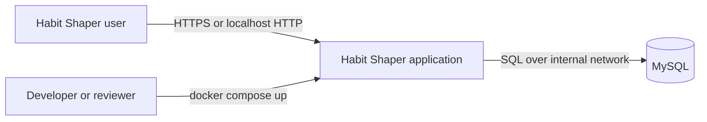
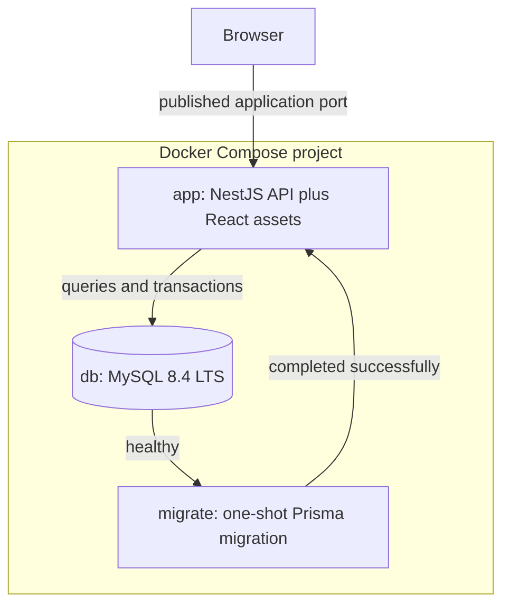
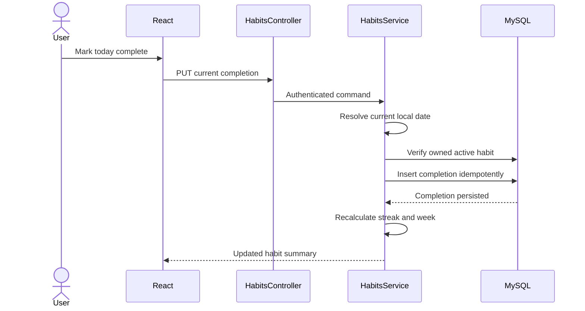
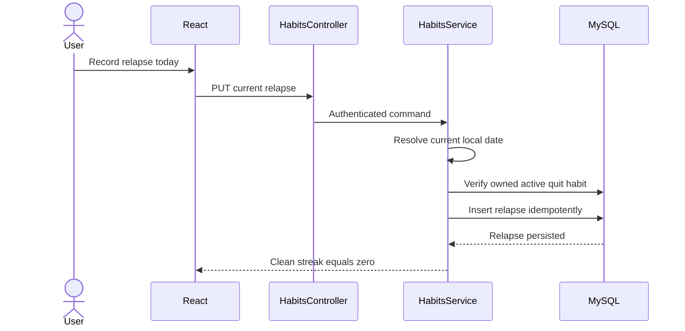

# Habit Shaper Architecture

**Status:** Accepted for MVP implementation  
**Last updated:** 2026-09-01  
**Decision owner:** Project developer  
**Decision horizon:** Coding-test MVP and its first production-like deployment

## 1. Purpose

This document defines the technical architecture for Habit Shaper. It explains the system shape, component responsibilities, dependency rules, runtime behavior, data authority, deployment model, failure handling, testing strategy, and the tradeoffs behind the selected stack.

The product requirements and behavioral acceptance criteria are defined separately in `MVP.md`.

## 2. Context and Constraints

Habit Shaper is a lightweight web application for authenticated users to:

- Build positive habits through same-day completion tracking.
- Quit unwanted habits through same-day relapse tracking.
- View streaks and weekly completion statistics.
- Create consecutive-day goals linked to habits.

Hard technical constraints from the coding brief:

- The frontend uses React.
- The backend uses Node.js with TypeScript.
- The database is MySQL.
- Authentication uses email and password without email verification.
- The complete application starts with `docker compose up` from the repository root.
- Docker and Docker Compose are the only required host tools.
- Schema initialization runs automatically on first boot.
- The repository contains no real secrets, local dependency directories, or build artifacts.

Scale, multi-region availability, regulatory requirements, and independent team ownership are not specified. This architecture does not invent those requirements.

## 3. Architectural Drivers

| Driver                           | Classification       | Priority      | Evidence                               |
| -------------------------------- | -------------------- | ------------- | -------------------------------------- |
| Complete end-to-end behavior     | Business outcome     | Must preserve | Explicit coding-test criterion         |
| One-command startup              | Technical constraint | Must preserve | Explicit coding-test requirement       |
| Correct date and streak behavior | User expectation     | Must preserve | Core product behavior                  |
| User data isolation              | Security requirement | Must preserve | Implied by authenticated personal data |
| Readable and reviewable code     | Team constraint      | Must preserve | Explicit code-quality criterion        |
| Simple operations                | Operational need     | Enabling      | Lightweight-product requirement        |
| Visible development history      | Delivery constraint  | Enabling      | Explicit Git-history criterion         |
| Independent service scaling      | Operational need     | Deferrable    | No evidence of need                    |
| Kubernetes deployment            | Platform option      | Deferrable    | Not required by the brief              |

## 4. Quality Scenarios

| ID  | Stimulus                                                       | Boundary           | Required response                                                                               | Evidence                                             |
| --- | -------------------------------------------------------------- | ------------------ | ----------------------------------------------------------------------------------------------- | ---------------------------------------------------- |
| Q1  | A reviewer clones the repository and runs `docker compose up`  | Deployment         | Database becomes ready, migrations complete, and the app becomes healthy without local runtimes | Compose smoke test from a clean environment          |
| Q2  | An authenticated user marks today's build habit complete twice | API and database   | One completion exists and both requests resolve consistently                                    | API integration test plus unique database constraint |
| Q3  | A user attempts to edit yesterday's outcome                    | Domain policy      | The request is rejected and historical data remains unchanged                                   | Boundary-date integration tests                      |
| Q4  | Two users request the same habit identifier                    | Authorization      | Only the owner can read or modify the habit                                                     | Cross-user integration tests                         |
| Q5  | The application starts while MySQL is still initializing       | Deployment         | Migration and app services wait on actual readiness without fixed sleeps                        | Compose health and dependency checks                 |
| Q6  | Today has not yet been completed                               | Streak calculation | Yesterday's active build streak remains visible until the current local day closes              | Clock-controlled unit tests                          |
| Q7  | A relapse is recorded today                                    | Quit-habit policy  | Clean streak becomes zero atomically and the next clean day begins at one                       | Unit and integration tests                           |
| Q8  | A migration fails                                              | Startup            | The app does not start against an unknown schema and logs expose the failure                    | Deliberately failing migration test                  |

## 5. Architecture Decision

Habit Shaper uses a **modular monolith** with one deployable application image and one MySQL database.

The application image contains:

- A React single-page application compiled into static files.
- A NestJS REST API.
- Prisma Client and migration tooling.

At runtime, NestJS serves both the REST API and the compiled React application. MySQL is the only stateful service.

### 5.1 System context



### 5.2 Runtime containers



Only the application port is published to the host. MySQL is reachable only through the Compose network.

## 6. Technology Stack

| Area                | Choice                                            | Responsibility                                               |
| ------------------- | ------------------------------------------------- | ------------------------------------------------------------ |
| Runtime             | Node.js 24 LTS                                    | Executes build tooling and the backend                       |
| Language            | TypeScript in strict mode                         | Compile-time safety across both applications                 |
| Workspace           | pnpm workspaces                                   | Dependency and script orchestration                          |
| Frontend            | React 19.2 and Vite 8                             | Browser interface and production asset build                 |
| Routing             | React Router                                      | Client-side route composition                                |
| Server state        | TanStack Query v5                                 | API queries, mutations, caching, and invalidation            |
| Forms               | React Hook Form                                   | Form state and submission behavior                           |
| Styling             | Tailwind CSS v4                                   | Small, consistent, responsive UI system                      |
| Backend             | NestJS 12 with Express adapter                    | REST transport, dependency injection, guards, and validation |
| API description     | OpenAPI through `@nestjs/swagger`                 | Reviewable API contract and generated client types           |
| ORM                 | Prisma 7                                          | Type-safe database access and committed migrations           |
| Database            | MySQL 8.4 LTS with InnoDB                         | Authoritative durable state                                  |
| Time handling       | Luxon behind an application clock                 | IANA-timezone and calendar-date calculations                 |
| Password hashing    | Argon2id                                          | Password verification and storage protection                 |
| Unit testing        | Vitest or the Nest-compatible project test runner | Domain and component behavior                                |
| End-to-end testing  | Playwright                                        | Browser-level critical journeys                              |
| Packaging           | Multi-stage Docker build                          | Reproducible application image                               |
| Local orchestration | Docker Compose v2                                 | Required one-command runtime                                 |

NestJS is selected instead of plain Fastify because its module, provider, guard, pipe, and testing conventions align with the likely reviewer environment. The default Express adapter avoids adapter-specific compatibility work that provides no material MVP benefit.

## 7. Logical Boundaries and Ownership

### 7.1 Frontend boundaries

Frontend dependencies flow in one direction:

```text
shared -> features -> app
```

- `shared` contains generic UI primitives, HTTP infrastructure, configuration, and generic utilities.
- `features` contains auth, habits, and goals code, including its components, queries, mutations, schemas, and hooks.
- `app` owns routing, global providers, layouts, page composition, and error boundaries.
- A feature does not import another feature directly. The app layer composes them.
- External code imports a feature only through its `index.ts` public API.
- Server state belongs to TanStack Query; transient presentation state remains local to components.
- The frontend never calculates authoritative streaks, dates, ownership, or goal completion.

### 7.2 Backend boundaries

Backend request flow:

```text
Request
  -> guard and validation
  -> controller
  -> application service
  -> pure domain policy and Prisma
  -> MySQL transaction
  -> response DTO
```

Backend modules:

| Module           | Owns                                                          | Does not own                    |
| ---------------- | ------------------------------------------------------------- | ------------------------------- |
| `AuthModule`     | Registration, login, logout, session creation and revocation  | Habit or goal policy            |
| `UsersModule`    | User lookup and profile timezone                              | Authentication transport        |
| `HabitsModule`   | Habits, completions, relapses, streaks, and weekly statistics | Goal lifecycle                  |
| `GoalsModule`    | Goal creation, progress, completion, editing, and removal     | Independent streak calculations |
| `DatabaseModule` | Prisma lifecycle and database connectivity                    | Business rules                  |
| `HealthModule`   | Process and database readiness reporting                      | Repair or migration logic       |

Controllers handle HTTP concerns only. Application services enforce ownership, coordinate transactions, and invoke domain calculations. Pure domain calculation files import neither NestJS nor Prisma.

`GoalsModule` obtains habit progress through a narrow service exported by `HabitsModule`; it does not bypass the module to reconstruct streak rules independently.

### 7.3 API contract boundary

The backend is the contract authority:

```text
NestJS DTOs
  -> generated OpenAPI document
  -> generated TypeScript API client
  -> frontend feature API functions
```

Generated client files are not manually edited. Prisma models and generated database types are never imported by the frontend.

## 8. Source Layout

```text
habit-shaper/
├── apps/
│   ├── web/
│   │   ├── src/
│   │   │   ├── app/
│   │   │   │   ├── layouts/
│   │   │   │   ├── pages/
│   │   │   │   ├── providers/
│   │   │   │   └── router/
│   │   │   ├── features/
│   │   │   │   ├── auth/
│   │   │   │   ├── habits/
│   │   │   │   └── goals/
│   │   │   ├── shared/
│   │   │   │   ├── api/
│   │   │   │   ├── components/
│   │   │   │   ├── config/
│   │   │   │   ├── lib/
│   │   │   │   └── styles/
│   │   │   ├── test/
│   │   │   └── main.tsx
│   │   ├── package.json
│   │   ├── tsconfig.json
│   │   └── vite.config.ts
│   │
│   └── api/
│       ├── prisma/
│       │   ├── migrations/
│       │   ├── schema.prisma
│       │   └── seed.ts
│       ├── src/
│       │   ├── auth/
│       │   ├── users/
│       │   ├── habits/
│       │   │   ├── domain/
│       │   │   └── dto/
│       │   ├── goals/
│       │   │   ├── domain/
│       │   │   └── dto/
│       │   ├── database/
│       │   ├── health/
│       │   ├── common/
│       │   ├── config/
│       │   ├── app.module.ts
│       │   └── main.ts
│       ├── test/
│       ├── nest-cli.json
│       ├── package.json
│       └── prisma.config.ts
│
├── packages/
│   └── api-client/
├── tests/
│   └── e2e/
├── docs/
│   └── decisions/
├── scripts/
├── .github/
│   └── workflows/
├── compose.yml
├── Dockerfile
├── .env.example
├── package.json
├── pnpm-lock.yaml
├── pnpm-workspace.yaml
├── tsconfig.base.json
└── README.md
```

Prisma is colocated with `apps/api` because the backend owns the database schema, migrations, and query behavior.

## 9. Data Authority

MySQL is authoritative for all durable product state. No frontend cache is authoritative.

| Fact                       | Authoritative writer           | Derived values                     | Integrity control                    |
| -------------------------- | ------------------------------ | ---------------------------------- | ------------------------------------ |
| User identity and timezone | `AuthModule` and `UsersModule` | Current local date                 | Unique normalized email              |
| Session                    | `AuthModule`                   | Authenticated request principal    | Hashed token, expiry, revocation     |
| Habit                      | `HabitsModule`                 | Display status                     | Owner foreign key and immutable type |
| Build completion           | `HabitsModule`                 | Build streak and weekly statistics | Unique habit and local-date pair     |
| Relapse                    | `HabitsModule`                 | Clean streak                       | Unique habit and local-date pair     |
| Goal                       | `GoalsModule`                  | Progress from current streak       | One active goal per habit            |
| Goal achievement           | `GoalsModule`                  | Completed-goal display             | Completion recorded permanently      |

Expected conceptual entities:

```text
User
  ├── Session
  ├── Habit
  │    ├── Completion
  │    ├── Relapse
  │    └── Goal
  └── timezone
```

The exact Prisma schema and API representations are implementation-owned details, but they must preserve the ownership and uniqueness invariants above.

## 10. Authentication and Authorization

Authentication uses an opaque database-backed session rather than JWT.

### 10.1 Registration

1. Validate and normalize the email address.
2. Validate the password policy.
3. Hash the password with Argon2id.
4. Insert the user, rejecting an existing normalized email.
5. Create a cryptographically random session token.
6. Store only the token hash with user ID, expiry, and timestamps.
7. Return the plaintext token only in an `HttpOnly` cookie.

### 10.2 Authenticated request

1. Read the session cookie.
2. Hash the received token.
3. Find an unexpired, non-revoked session.
4. Attach the authenticated principal to the request.
5. Scope every resource query by both resource ID and authenticated user ID.

Cookie policy:

```text
HttpOnly
SameSite=Lax
Secure in production
Path=/
```

Logout revokes or deletes the current session and expires the browser cookie. Passwords and session tokens are never logged.

Authorization is enforced server-side. Hiding a frontend control is not an authorization mechanism.

## 11. Time and Calendar Authority

Date correctness is a domain concern because streaks depend on calendar-day boundaries.

- The user's saved IANA timezone determines the current local date.
- The backend calculates that date through an injectable clock abstraction.
- Clients cannot choose which historical date is editable.
- Exact event timestamps are stored in UTC.
- Completion and relapse records also store their authoritative local calendar date.
- A timezone change affects future events only; it does not rewrite historical local dates.
- Unit tests replace the system clock with a deterministic fake clock.

Historical integrity rule:

```text
current local date -> record or undo allowed
past local date    -> permanently locked
future local date  -> rejected
```

## 12. Core Runtime Flows

### 12.1 Record build completion



The database uniqueness constraint is the final duplicate-write defense. A second identical request returns the same logical result.

### 12.2 Record relapse



### 12.3 Complete a goal

Goal progress is derived from the linked habit's current streak. When a streak first reaches the active goal target, the backend records goal completion in the same request transaction that produces the updated result. A later missed day or relapse does not erase the completed achievement.

No asynchronous queue or eventual-consistency mechanism is required for the MVP.

## 13. Transaction and Consistency Rules

- User registration and initial session creation are one logical operation; partial failure must not expose an unusable authenticated state.
- Recording a completion or relapse is atomic at the database level.
- Duplicate same-day writes are idempotent within `(habit_id, local_date)`.
- Ownership is verified within the same request that performs the mutation.
- Goal completion is recorded transactionally with the state transition that establishes completion when practical.
- Read-after-write responses are calculated from committed state.
- No state-changing transaction remains open across an external network call.

MySQL remains the single consistency boundary. There are no queues, replicas, or distributed transactions in the MVP.

## 14. Error Contract

The API returns a stable JSON error envelope:

```json
{
  "error": {
    "code": "HABIT_DATE_LOCKED",
    "message": "Past habit outcomes cannot be changed.",
    "requestId": "..."
  }
}
```

Error categories:

| Category                          | HTTP behavior             | Example                        |
| --------------------------------- | ------------------------- | ------------------------------ |
| Validation                        | `400`                     | Invalid email or target days   |
| Authentication                    | `401`                     | Missing or expired session     |
| Authorization or hidden ownership | `404` where appropriate   | Another user's habit ID        |
| Conflict                          | `409`                     | Duplicate email or active goal |
| Domain policy                     | `422` or documented `409` | Past date is locked            |
| Unexpected dependency failure     | `500` or `503`            | Database unavailable           |

Unexpected errors are logged with request IDs. Responses never expose stack traces, SQL, secrets, password hashes, or session tokens.

## 15. Deployment and Startup

### 15.1 Compose services

| Service   | Lifecycle    | Published port        | Durable state                     |
| --------- | ------------ | --------------------- | --------------------------------- |
| `db`      | Long running | None                  | Named MySQL volume                |
| `migrate` | One-shot     | None                  | Writes schema migrations to MySQL |
| `app`     | Long running | Application port only | Stateless container filesystem    |

Startup behavior:

1. Compose starts MySQL.
2. The MySQL health check verifies actual database readiness.
3. The migration service runs `prisma migrate deploy` using the application image.
4. Migration failure prevents application startup.
5. The application starts after successful migration.
6. The application health endpoint verifies process and database readiness.

`depends_on` without a health condition is insufficient. Fixed sleep scripts are prohibited.

### 15.2 Image build

The root Dockerfile is a multi-stage build:

```text
dependency stage
  -> frontend build stage
  -> backend build stage
  -> minimal runtime stage
```

The runtime image contains production dependencies, compiled NestJS output, React static assets, and the migration artifacts required by the `migrate` service. It runs as a non-root user where supported by the selected image and file permissions.

### 15.3 Configuration

- `.env.example` documents all required variables with placeholders.
- Configuration is validated at application startup.
- Missing required variables cause a clear fail-fast error.
- Real `.env` files, certificates, and keys are excluded from Git.
- MySQL uses a dedicated application user rather than the root account.

## 16. Failure Behavior and Recovery

| Failure                                 | Detection                            | User-visible behavior                    | Recovery                                                  |
| --------------------------------------- | ------------------------------------ | ---------------------------------------- | --------------------------------------------------------- |
| MySQL not ready                         | Database health check                | App does not start prematurely           | Compose waits for health                                  |
| Migration failure                       | Non-zero migration exit              | App remains stopped                      | Fix migration and restart Compose                         |
| Database unavailable after startup      | Query failure and readiness check    | API returns a controlled service error   | Restore DB; app reconnects through Prisma/driver behavior |
| Duplicate completion or relapse request | Unique constraint or existing record | Same logical success result              | No reconciliation required                                |
| Expired session                         | Session lookup                       | `401`, frontend returns to login         | User logs in again                                        |
| Invalid or hostile input                | Validation pipe                      | Structured client error                  | User corrects input                                       |
| Frontend asset route refresh            | Static fallback                      | React application loads instead of `404` | Nest serves `index.html` for non-API routes               |
| Process restart                         | Container restart                    | Brief unavailability                     | Stateless app resumes from MySQL state                    |

Named database volumes survive ordinary `docker compose down`. Removing volumes is a deliberate destructive operation and is not part of standard instructions.

## 17. Observability

The MVP uses proportional observability:

- Structured JSON application logs.
- A request ID attached to logs and error responses.
- Request method, route template, status, and duration.
- Authentication failures without logging credentials.
- Startup, migration, and database connectivity events.
- Health endpoint for Compose and smoke tests.

Metrics aggregation, distributed tracing infrastructure, and external dashboards are deferred because the MVP has one application process and no evidence of a production observability platform requirement.

## 18. Testing Strategy

### 18.1 Unit tests

Pure tests cover:

- Build streak calculation.
- Clean streak calculation.
- Weekly eligible, completed, and missed days.
- Current-day versus locked historical dates.
- Timezone and midnight boundaries.
- Goal progress and permanent completion.

### 18.2 Backend integration tests

Integration tests cover:

- Registration, login, logout, and session expiry.
- Cross-user resource isolation.
- Same-day completion and relapse idempotency.
- Database uniqueness constraints.
- Past and future date rejection.
- Transaction rollback on failure.
- OpenAPI generation.

### 18.3 Frontend tests

Component tests cover form errors, loading states, mutation states, and accessible interactions. API behavior is mocked at the network boundary rather than by mocking internal hooks.

### 18.4 End-to-end tests

Playwright covers the minimum user journeys:

1. Register and log in.
2. Create and complete a build habit.
3. Create a quit habit and record a relapse.
4. Create, edit, progress, and remove a goal.
5. Log out and confirm protected routes are unavailable.

### 18.5 Deployment tests

- `docker compose config --quiet`
- Clean-image build.
- Clean-volume first boot.
- Migration success.
- Health endpoint readiness.
- Browser smoke test against the published port.

## 19. CI and Optional Delivery Infrastructure

The minimum CI pipeline is:

```text
install
  -> lint
  -> type-check
  -> unit tests
  -> integration tests
  -> production build
  -> Compose smoke test
  -> container vulnerability scan
```

Jenkins may implement this pipeline if it matches the reviewer's environment. CI is not required to run the application locally.

Kind, Argo CD, Kubernetes, a container registry, and Envoy Gateway are optional bonus infrastructure. They must not replace or complicate the mandatory Compose path. If later implemented, the correct GitOps flow is:

```text
application repository
  -> Jenkins builds, tests, scans, and pushes an image
  -> Jenkins updates a GitOps repository image reference
  -> Argo CD observes the GitOps repository
  -> Argo CD reconciles the Kubernetes cluster
  -> Envoy Gateway routes traffic to Habit Shaper
```

## 20. Security Baseline

- Argon2id password hashing.
- Opaque sessions stored as token hashes.
- `HttpOnly`, `SameSite=Lax`, and production `Secure` cookies.
- Server-side authorization for every owned resource.
- DTO validation and response shaping.
- Parameterized database access through Prisma.
- No secrets in Git, logs, images, or error responses.
- Dependency and image vulnerability scanning in CI.
- Security headers appropriate to the single-origin application.
- Rate limiting on registration and login endpoints.

A formal threat model and production secret-management system are separate specialist tasks if the application moves beyond the coding-test environment.

## 21. Architecture Fitness Checks

| Architecture claim                            | Automated or review evidence                         | Failure action              |
| --------------------------------------------- | ---------------------------------------------------- | --------------------------- |
| One-command startup                           | Clean `docker compose up` smoke test                 | Block delivery              |
| Database readiness precedes migration         | Compose configuration and first-boot test            | Fix health/dependency model |
| Historical outcomes are immutable             | Domain and API boundary tests                        | Block merge                 |
| Users are isolated                            | Cross-user integration test suite                    | Block merge                 |
| Frontend dependency direction is preserved    | ESLint restricted-import rules                       | Block merge                 |
| Features expose public APIs only              | ESLint deep-import rules                             | Block merge                 |
| Domain calculations are framework-independent | Import-boundary test or review                       | Refactor before merge       |
| API and client types agree                    | Regenerate OpenAPI client and require clean Git diff | Block merge                 |
| Schema matches committed migrations           | Migration from an empty database                     | Block delivery              |
| Images contain no development-only artifacts  | Image inspection and vulnerability scan              | Rebuild image               |

## 22. Alternatives and Tradeoffs

### 22.1 Modular monolith versus microservices

**Selected:** Modular monolith.

Benefits:

- One owner, one deployment, and one transactional boundary.
- Lower cognitive and operational cost.
- Direct fit for the coding-test scope.

Accepted costs:

- Frontend and API deployments are coupled.
- Independent scaling is unavailable.

Microservices are rejected because there is no independent ownership, scaling, failure-isolation, or release requirement that compensates for distributed transactions and operational overhead.

### 22.2 Combined application container versus separate web container

**Selected:** NestJS serves the compiled React application.

Benefits:

- One public origin and no CORS configuration.
- Simpler authentication cookies.
- Fewer containers and configuration files.

Accepted cost:

- Static assets and the API deploy together.

A separate Nginx or web container can be introduced later if measured traffic or deployment independence justifies it.

### 22.3 NestJS versus plain Fastify

**Selected:** NestJS with its default Express adapter.

Benefits:

- Familiar modules, providers, guards, pipes, and testing conventions.
- Strong alignment with the likely reviewer's backend stack.
- Explicit structure for code-quality evaluation.

Accepted costs:

- More framework boilerplate than plain Fastify.
- Dependency injection and decorator conventions must be used consistently.

### 22.4 Database sessions versus JWT

**Selected:** Opaque database-backed sessions.

Benefits:

- Simple revocation, logout, and expiry.
- Well matched to a same-origin application.
- No refresh-token lifecycle.

Accepted cost:

- Each authenticated request performs or caches a session lookup.

JWT can be reconsidered only if stateless cross-service authentication or external API consumers become real requirements.

### 22.5 Compose versus mandatory Kubernetes

**Selected:** Docker Compose is mandatory; Kubernetes is optional.

Compose directly satisfies the brief. Mandatory Kubernetes would increase prerequisites and violate the intended one-command reviewer experience.

## 23. Evolution Path

Evolution happens only when evidence changes a driver:

1. Implement and verify the modular monolith.
2. Measure actual bottlenecks and change frequency.
3. Add a separate static frontend deployment only if independent deployment or asset traffic requires it.
4. Add Redis only if measured session or caching requirements justify another stateful dependency.
5. Introduce background jobs only for a real asynchronous workflow such as reminders.
6. Consider Kubernetes only when the target environment requires cluster deployment.
7. Consider service extraction only when a module has independent ownership, scaling, deployment, and recoverable failure behavior.

Any future extraction must preserve data authority, authorization, date policy, idempotency, and migration compatibility. The current monolith remains the default until those benefits are evidenced.

## 24. Open Questions and Evidence Gaps

- The final hosting environment is unknown.
- Expected user count and traffic are unknown.
- The reviewer's exact NestJS, testing, and CI conventions are unknown.
- Production secret storage and TLS termination are outside the supplied requirements.
- Backup, restore, RTO, and RPO expectations are not specified.
- Accessibility targets beyond sound web practice are not explicitly stated.

These gaps do not block the MVP. They must be resolved before claiming production readiness beyond the coding-test context.

## 25. Decision Summary

The approved architecture is a TypeScript modular monolith consisting of a React SPA, a NestJS REST API, Prisma, and MySQL. NestJS serves the compiled frontend, MySQL owns all durable state, and Docker Compose orchestrates database readiness, one-shot migrations, and application startup. Business rules remain backend-authoritative and framework-independent where practical. Automated tests enforce ownership, historical integrity, timezone correctness, module boundaries, migration reproducibility, and one-command startup.
