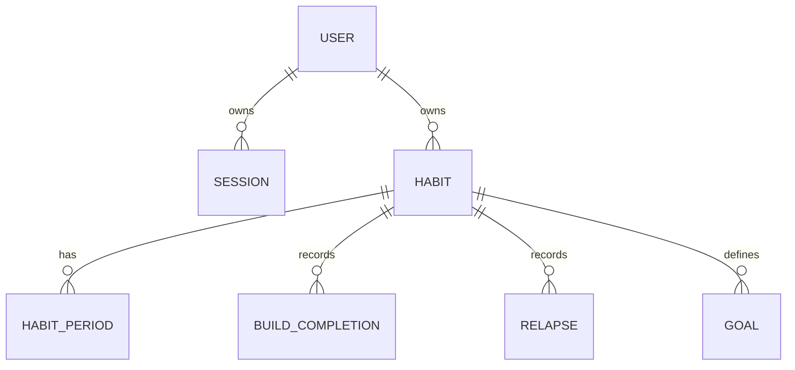

# Habit Shaper Data Model

## 1. Purpose

This document defines the authoritative data model for the Habit Shaper MVP. It translates the approved product rules into persistence boundaries, relationships, and integrity constraints for Prisma and MySQL.

MySQL is authoritative for durable state. Streaks, weekly statistics, missed days, and goal progress are derived by the backend rather than stored as mutable counters.

## 2. Conventions

### Identifiers

Use application-generated UUIDs stored as `CHAR(36)`. Identifiers are opaque to clients.

### Dates and timestamps

- Daily habit outcomes use MySQL `DATE` and represent the user's local calendar date.
- Audit and lifecycle timestamps use UTC `DATETIME(3)`.
- The backend derives the current local date from the user's IANA timezone.
- The frontend never supplies an authoritative tracking date.

### Ownership

`User` is the authorization boundary. Every habit query and mutation must include the authenticated `userId`; resolving a record by public identifier alone is insufficient.

## 3. Relationship Model



## 4. Entities

### 4.1 User

| Field          | Database type  | Rules                                     |
| -------------- | -------------- | ----------------------------------------- |
| `id`           | `CHAR(36)`     | Primary key                               |
| `email`        | `VARCHAR(254)` | Required, normalized to lowercase, unique |
| `passwordHash` | `VARCHAR(255)` | Required Argon2id hash; never returned    |
| `timezone`     | `VARCHAR(64)`  | Required valid IANA timezone              |
| `createdAt`    | `DATETIME(3)`  | UTC creation timestamp                    |
| `updatedAt`    | `DATETIME(3)`  | UTC update timestamp                      |

### 4.2 Session

| Field       | Database type | Rules                                    |
| ----------- | ------------- | ---------------------------------------- |
| `id`        | `CHAR(36)`    | Primary key                              |
| `userId`    | `CHAR(36)`    | Foreign key to `User.id`                 |
| `tokenHash` | `CHAR(64)`    | SHA-256 hash of the opaque token, unique |
| `expiresAt` | `DATETIME(3)` | Required expiration                      |
| `revokedAt` | `DATETIME(3)` | Nullable revocation timestamp            |
| `createdAt` | `DATETIME(3)` | UTC creation timestamp                   |

Only the token hash is persisted. The raw token exists only in the secure session cookie.

Recommended indexes:

- Unique index on `tokenHash`.
- Index on `(userId, expiresAt)`.

### 4.3 Habit

| Field       | Database type                | Rules                    |
| ----------- | ---------------------------- | ------------------------ |
| `id`        | `CHAR(36)`                   | Primary key              |
| `userId`    | `CHAR(36)`                   | Foreign key to `User.id` |
| `name`      | `VARCHAR(100)`               | Required after trimming  |
| `type`      | `ENUM('BUILD', 'QUIT')`      | Immutable after creation |
| `status`    | `ENUM('ACTIVE', 'ARCHIVED')` | Current lifecycle state  |
| `createdAt` | `DATETIME(3)`                | UTC creation timestamp   |
| `updatedAt` | `DATETIME(3)`                | UTC update timestamp     |

Recommended index: `(userId, status, createdAt)`.

Hard deletion is outside the MVP. Archiving changes lifecycle state while preserving outcomes and goals.

### 4.4 HabitPeriod

A tracking period preserves eligibility when a habit is archived and later restored.

| Field       | Database type | Rules                             |
| ----------- | ------------- | --------------------------------- |
| `id`        | `CHAR(36)`    | Primary key                       |
| `habitId`   | `CHAR(36)`    | Foreign key to `Habit.id`         |
| `startedOn` | `DATE`        | First eligible local date         |
| `endedOn`   | `DATE`        | Nullable last eligible local date |
| `createdAt` | `DATETIME(3)` | UTC creation timestamp            |

Rules:

- Creating a habit creates one open tracking period.
- Archiving closes the open period on the user's current local date.
- Restoring creates a new open period.
- Periods for one habit cannot overlap.
- An active habit has exactly one open period.
- An archived habit has no open period.

The single-open-period rule is enforced in the application transaction and covered by database integration tests.

### 4.5 BuildCompletion

| Field         | Database type | Rules                        |
| ------------- | ------------- | ---------------------------- |
| `id`          | `CHAR(36)`    | Primary key                  |
| `habitId`     | `CHAR(36)`    | Foreign key to a build habit |
| `completedOn` | `DATE`        | User-local completion date   |
| `createdAt`   | `DATETIME(3)` | UTC creation timestamp       |

Required database constraint:

```text
UNIQUE(habitId, completedOn)
```

Rules:

- Only `BUILD` habits accept completion records.
- Only today's local completion may be created or undone.
- Duplicate requests resolve idempotently and never create duplicate rows.

### 4.6 Relapse

| Field        | Database type | Rules                       |
| ------------ | ------------- | --------------------------- |
| `id`         | `CHAR(36)`    | Primary key                 |
| `habitId`    | `CHAR(36)`    | Foreign key to a quit habit |
| `relapsedOn` | `DATE`        | User-local relapse date     |
| `createdAt`  | `DATETIME(3)` | UTC creation timestamp      |

Required database constraint:

```text
UNIQUE(habitId, relapsedOn)
```

Rules:

- Only `QUIT` habits accept relapse records.
- Only today's local relapse may be created or undone.
- Duplicate requests resolve idempotently and never create duplicate rows.

### 4.7 Goal

| Field        | Database type                            | Rules                              |
| ------------ | ---------------------------------------- | ---------------------------------- |
| `id`         | `CHAR(36)`                               | Primary key                        |
| `habitId`    | `CHAR(36)`                               | Foreign key to `Habit.id`          |
| `targetDays` | `INT UNSIGNED`                           | Required and greater than zero     |
| `status`     | `ENUM('ACTIVE', 'COMPLETED', 'REMOVED')` | Goal lifecycle                     |
| `activeSlot` | `TINYINT`                                | `1` while active; otherwise `NULL` |
| `achievedAt` | `DATETIME(3)`                            | Set permanently on completion      |
| `removedAt`  | `DATETIME(3)`                            | Set when an active goal is removed |
| `createdAt`  | `DATETIME(3)`                            | UTC creation timestamp             |
| `updatedAt`  | `DATETIME(3)`                            | UTC update timestamp               |

Required database constraint:

```text
UNIQUE(habitId, activeSlot)
```

MySQL allows multiple `NULL` values in a unique index. Historical goals therefore use `NULL`, while only one goal per habit may hold `activeSlot = 1`.

Rules:

- A goal belongs to exactly one owned habit.
- Goal progress is derived from the habit's current streak.
- Progress cannot be edited directly.
- Reaching the target permanently completes the goal.
- Completion and the qualifying daily outcome are handled atomically.

## 5. Derived Values

The backend derives these values at query or domain-service boundaries:

- Current build streak.
- Current clean streak.
- Weekly eligible, completed, and missed days.
- Weekly completion rate.
- Current goal progress.
- Newly achieved goal state.

Persisting these values would create synchronization and retroactive-correction risks, so they are not database columns in the MVP.

## 6. Calculation Invariants

### Build streak

- Consecutive eligible dates with completion records increase the streak.
- An unchecked current day does not prematurely break yesterday's streak.
- A closed eligible day without a completion breaks the streak.
- Dates outside tracking periods are excluded.

### Clean streak

- A relapse on the current date produces a clean streak of zero.
- The first eligible clean day after a relapse produces a streak of one.
- Dates outside tracking periods are excluded.

### Weekly build statistics

```text
completion rate = completed eligible days / elapsed eligible days
missed days = elapsed eligible days - completed eligible days
```

- Future days are excluded.
- Dates before the first tracking period are excluded.
- Archived gaps are excluded.
- Monday is the assumed first day of the week.
- The user's timezone determines date and week boundaries.

## 7. Referential and Lifecycle Policy

- Sessions may be revoked or deleted without deleting the user.
- Archiving a habit never deletes its periods, outcomes, relapses, or goals.
- User and habit hard deletion are outside the MVP.
- Foreign keys prevent orphaned records.
- Shared migrations are corrected with new migrations rather than rewritten.
- Migration rollback must not silently discard habit history.

## 8. Integrity Verification

The initial schema is accepted only when automated tests prove:

- Normalized emails are unique.
- Session token hashes are unique.
- Duplicate completions and relapses are rejected at database level.
- Only one active goal exists per habit.
- Cross-user access is rejected.
- Supported lifecycle operations cannot create overlapping tracking periods.
- Build outcomes cannot be written to quit habits.
- Relapses cannot be written to build habits.
- Historical and future outcome mutations are rejected.
- Empty-database migration succeeds without a manual schema step.

## 9. Implementation Boundary

This document specifies persistence behavior, not the final Prisma syntax. `FOUND-002` owns the concrete schema and migration, and any deviation must preserve these invariants and be recorded in the decision log.
