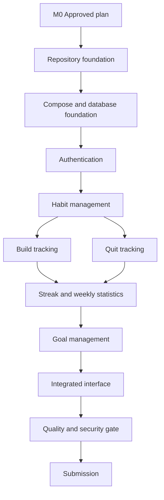

# Habit Shaper Development Plan and Delivery Story

**Status:** Approved plan, implementation not started  
**Last updated:** 2026-09-01  
**Product decision owner:** Project developer  
**Implementation owner:** Project developer with coding-agent assistance  
**Source requirements:** Coding-test brief, `MVP.md`, and `architecture.md`

## 1. Purpose

This document is the operating plan for developing and submitting Habit Shaper. It describes the intended development story from product understanding through repository handoff. It also acts as the task-management source of truth during implementation.

The document is designed to answer five questions at any point in the project:

1. What outcome are we building toward?
2. What has been decided and why?
3. What task is currently in progress?
4. What evidence proves a task is complete?
5. Does the repository tell a credible story to the reviewer?

Product behavior belongs in `MVP.md`. System design belongs in `architecture.md`. This file owns execution order, task status, dependencies, verification, Git history, and submission readiness.

## 2. Project Vision

Habit Shaper should feel small, trustworthy, and complete.

The user should be able to register, create a habit, record today's outcome, and immediately understand their progress. A build habit records a positive behavior completed today. A quit habit advances automatically while the unwanted behavior is avoided and resets when a relapse is recorded. Goals turn those streaks into measurable milestones.

The engineering vision is equally important:

- The product rules are explicit rather than implied by UI behavior.
- Historical tracking data cannot be rewritten after the day closes.
- The backend is authoritative for ownership, dates, streaks, statistics, and goals.
- The frontend is clean, responsive, accessible, and focused on the daily action.
- The repository starts with one `docker compose up` command.
- Every meaningful development step is visible through code, tests, documents, decisions, and Git history.
- Coding-agent output is reviewed, corrected, and verified rather than accepted blindly.

The goal is not to demonstrate the largest possible stack. The goal is to demonstrate product judgment, technical correctness, delivery discipline, and complete end-to-end execution.

## 3. Success Definition

The project succeeds when a reviewer can:

1. Clone the private repository.
2. Run `docker compose up --build` from the repository root.
3. Wait for MySQL readiness and automatic migrations.
4. Open the application in a browser.
5. Register and log in.
6. Create build and quit habits.
7. Record today's completion or relapse.
8. See correct streak and weekly progress calculations.
9. Create and complete a consecutive-day goal.
10. Inspect readable code, focused tests, meaningful commits, and documented agentic development.

Completion is based on evidence, not a claim that the application is done.

## 4. Approved Scope

### 4.1 Included

- Email/password registration, login, and logout.
- Database-backed opaque sessions.
- User timezone storage and backend calendar authority.
- Daily build habits.
- Same-day build completion and undo.
- Build streak calculation.
- Weekly eligible, completed, and missed-day statistics.
- Quit habits.
- Same-day relapse recording and undo.
- Clean-streak calculation.
- Consecutive-day goals linked to habits.
- Goal add, edit, remove, progress, and permanent completion.
- Habit rename and archive behavior needed for safe lifecycle management.
- Responsive React interface.
- NestJS REST API.
- MySQL persistence through Prisma.
- Automatic first-boot migrations.
- Docker Compose execution from the repository root.
- Unit, integration, and critical end-to-end tests.
- README, architecture, product, agentic-development, and submission documentation.

### 4.2 Excluded

- Email verification and password reset.
- Social login.
- Reminders and notifications.
- Social or community features.
- Native mobile clients.
- Retroactive completion or relapse editing.
- Custom habit schedules.
- Weekly or percentage-based goals.
- Offline synchronization.
- Redis, queues, microservices, CQRS, and event sourcing.
- Mandatory Kubernetes, Argo CD, Envoy Gateway, or cloud deployment.
- Advanced analytics beyond the required streak and weekly statistics.

Any excluded item requires an explicit scope decision before it enters the task board.

## 5. Technical Baseline

| Area                  | Decision                                                        |
| --------------------- | --------------------------------------------------------------- |
| Architecture          | Modular monolith                                                |
| Frontend              | React 19.2, Vite 8, TypeScript                                  |
| Backend               | NestJS 12 with Express adapter                                  |
| Database              | MySQL 8.4 LTS with Prisma 7                                     |
| Authentication        | Argon2id passwords and opaque database sessions                 |
| API                   | REST JSON with DTO validation and OpenAPI                       |
| Styling               | Tailwind CSS v4                                                 |
| Server state          | TanStack Query v5                                               |
| Forms                 | React Hook Form                                                 |
| Time                  | Backend IANA-timezone handling behind an injectable clock       |
| Workspace             | pnpm workspaces                                                 |
| Packaging             | Multi-stage Dockerfile                                          |
| Required orchestrator | Root `compose.yml`                                              |
| Tests                 | Unit, API integration, database integration, and Playwright E2E |

The exact root Compose filename is `compose.yml` because that is what the coding brief explicitly requests.

## 6. Stakeholders and Responsibilities

| Role              | Responsibility                                                                                    | Authority                                           |
| ----------------- | ------------------------------------------------------------------------------------------------- | --------------------------------------------------- |
| Project developer | Product decisions, implementation, verification, repository ownership, and submission             | Final decision maker                                |
| Coding agent      | Analysis, planning, code generation, test generation, review assistance, and documentation drafts | No independent product or external-action authority |
| Reviewer          | Evaluates agentic development, code quality, completeness, and Git history                        | Submission evaluator                                |
| GitHub            | Hosts the private repository and collaborator invitation                                          | External dependency                                 |
| Docker runtime    | Executes the reviewer-facing application environment                                              | External runtime dependency                         |

External actions such as creating the repository, pushing code, or inviting the reviewer happen only after explicit developer authorization.

## 7. Development Principles

### 7.1 Build vertical slices

Prefer an end-to-end capability over isolated horizontal layers.

Good slice:

```text
Register form
  -> registration endpoint
  -> password hashing
  -> user persistence
  -> session cookie
  -> integration test
```

Avoid considering registration complete after creating only the database model or only the form.

### 7.2 Keep business policy explicit

Rules such as same-day editing, streak boundaries, ownership, and goal completion belong in testable backend policy. They must not be implied solely by disabled frontend controls.

### 7.3 Keep one source of truth

- MySQL is authoritative for durable state.
- The backend is authoritative for dates and calculated progress.
- `MVP.md` is authoritative for product behavior.
- `architecture.md` is authoritative for technical boundaries.
- This document is authoritative for task status and delivery order.

### 7.4 Verify before claiming completion

A task cannot move to `DONE` because code exists. Its acceptance commands must pass, its diff must be reviewed, and its evidence must be recorded.

### 7.5 Preserve the development story

Commit each logical capability with its tests and related documentation. Do not collapse the entire project into a single final commit.

## 8. Task Management Model

### 8.1 Task states

| State         | Meaning                                                              |
| ------------- | -------------------------------------------------------------------- |
| `BACKLOG`     | Useful work that is not yet ready to start                           |
| `READY`       | Scope, dependencies, and acceptance criteria are clear               |
| `IN_PROGRESS` | Actively being implemented; one accountable owner                    |
| `IN_REVIEW`   | Implementation finished; tests, diff, and behavior being checked     |
| `BLOCKED`     | Cannot proceed because a named dependency or decision is unavailable |
| `DONE`        | Acceptance evidence exists and related documentation is current      |

### 8.2 Work-in-progress limit

- Maximum one primary implementation task in `IN_PROGRESS`.
- One review or documentation task may run alongside it.
- Do not start another feature while the current feature lacks tests or integration evidence.

This limit protects the Git story and prevents half-finished features from accumulating.

### 8.3 Definition of Ready

A task is `READY` only when:

- Its user or engineering outcome is stated.
- Included and excluded behavior is clear.
- Dependencies are satisfied or named.
- Acceptance criteria are testable.
- Required product decisions are resolved.
- The intended commit scope is known.
- No unapproved external action is hidden inside it.

### 8.4 Definition of Done

A task is `DONE` only when:

- The requested behavior works end to end where applicable.
- Ownership and authorization are enforced.
- Input and output validation are present.
- Relevant unit and integration tests pass.
- Type checking, linting, and formatting pass.
- The implementation follows module-boundary rules.
- Error and loading behavior are handled.
- No real secret or generated build output is introduced.
- Related product, architecture, API, or README documentation is updated.
- Agent-generated work has been reviewed by the developer.
- The diff contains only the task's logical change.
- A meaningful commit or PR records the result.

### 8.5 Task record template

Use this template when adding or expanding a task:

```md
### TASK-ID: Short task name

- Status:
- Owner:
- Outcome:
- In scope:
- Out of scope:
- Hard dependencies:
- Acceptance criteria:
- Verification commands:
- Evidence artifact:
- Agent contribution:
- Human decisions:
- Intended commit:
- Risks or notes:
```

## 9. Current Project Board

This is the status at the time this plan is created.

### Done

- [x] `DISC-001` Read and extract the complete coding-test brief.
- [x] `DISC-002` Define build, quit, relapse, streak, and goal terminology.
- [x] `DISC-003` Resolve historical tracking integrity: only today is editable.
- [x] `DISC-004` Define streak-based MVP goals.
- [x] `SPEC-001` Create the approved MVP specification.
- [x] `ARCH-001` Select the modular-monolith architecture.
- [x] `ARCH-002` Select React, NestJS, Prisma, MySQL, and Compose stack.
- [x] `ARCH-003` Define frontend and backend module boundaries.
- [x] `ARCH-004` Create the architecture document.
- [x] `PLAN-001` Define the submission and evaluation strategy.
- [x] `PLAN-002` Create this delivery and task-management plan.
- [x] `REPO-001` Initialize the pnpm monorepo and repository controls.

### Ready

- [ ] `DOC-001` Move approved planning documents into the repository `docs/` directory.
- [ ] `CI-001` Add the foundation pull-request quality workflow.

### Backlog

- [ ] All implementation, verification, CI, and submission tasks listed below.

### Blocked by external input

- [ ] `SUB-002` Invite the reviewer; blocked until the reviewer identity is provided.
- [ ] `SUB-001` Create or connect the private GitHub repository; requires explicit authorization and repository name.

## 10. Milestones

| Milestone                        | Outcome                                                                        | Exit gate                                              |
| -------------------------------- | ------------------------------------------------------------------------------ | ------------------------------------------------------ |
| M0 - Approved plan               | Scope, architecture, and delivery process are recorded                         | Planning documents approved                            |
| M1 - Reproducible foundation     | Empty application boots through `compose.yml` with automatic migrations        | Clean-volume Compose smoke test passes                 |
| M2 - Authenticated product shell | User can register, log in, remain authenticated, and log out                   | Auth API and browser tests pass                        |
| M3 - Habit management            | User can create, view, rename, and archive owned build and quit habits         | Cross-user and lifecycle tests pass                    |
| M4 - Daily tracking              | Build completion and relapse flows enforce same-day integrity                  | Clock and idempotency tests pass                       |
| M5 - Progress                    | Correct build streaks, clean streaks, and weekly completion data are displayed | Calculation and integrated UI tests pass               |
| M6 - Goals                       | User can manage and complete streak-based goals                                | Goal lifecycle tests pass                              |
| M7 - Product-quality candidate   | UI, errors, accessibility, tests, docs, and CI meet the release gate           | Full local and CI verification passes                  |
| M8 - Submission                  | Private repository is clean, runnable, documented, and shared with reviewer    | Fresh-clone rehearsal and invitation verification pass |

## 11. Work Breakdown

Relative size indicates complexity, not a calendar commitment. No deadline was supplied, so the plan does not invent dates.

### Phase A: Repository and planning foundation

#### REPO-001: Initialize the monorepo

- **Status:** `DONE`
- **Size:** S
- **Outcome:** A clean pnpm workspace supports the React app, NestJS app, shared API client, root quality commands, and reproducible dependency installation.
- **Deliverables:** Root `package.json`, `pnpm-workspace.yaml`, lockfile, base TypeScript configuration, ESLint, Prettier, EditorConfig, `.gitignore`, and `.dockerignore`.
- **Dependencies:** M0.
- **Acceptance:** A clean dependency install succeeds; root lint, type-check, and test commands resolve all workspaces.
- **Intended commit:** `chore: initialize pnpm monorepo`

#### DOC-001: Install approved documentation in the repository

- **Status:** `IN PROGRESS`
- **Size:** S
- **Outcome:** The repository begins with an inspectable product and architecture baseline.
- **Deliverables:** `docs/MVP.md`, `docs/architecture.md`, this plan, `docs/data-model.md`, `docs/task-breakdown.md`, and initial decision records.
- **Dependencies:** REPO-001.
- **Acceptance:** Documents use the exact root filename `compose.yml`, agree on the stack, and contain no private local paths.
- **Intended commit:** `docs: add product architecture and delivery plan`

#### CI-001: Add foundation continuous integration

- **Status:** `READY`
- **Size:** S
- **Outcome:** Every application change begins with an automatic pull-request quality gate instead of deferring feedback until hardening.
- **Deliverables:** A GitHub Actions workflow with read-only permissions, Node.js 24, pnpm 10.13.1, dependency caching, concurrency cancellation, and a bounded timeout.
- **Dependencies:** REPO-001 and stable root scripts.
- **Acceptance:** A pull request runs frozen installation, formatting, linting, type-checking, unit tests, and production builds through the same root commands used locally.
- **Intended commit:** `ci: add foundation quality workflow`

#### REPO-002: Establish branch and commit controls

- **Status:** `BACKLOG`
- **Size:** S
- **Outcome:** Future changes use consistent branches, Conventional Commits, and pre-commit quality checks.
- **Deliverables:** Commit convention in `CONTRIBUTING.md`, lightweight hooks where appropriate, and CI-aligned root scripts.
- **Dependencies:** CI-001.
- **Acceptance:** A sample branch can run the same quality commands used by CI; hooks do not require a host Node installation for reviewer startup.
- **Intended commit:** `chore(repo): add contribution and commit conventions`

### Phase B: Containerized foundation

#### FOUND-001: Scaffold React and NestJS applications

- **Status:** `READY`
- **Size:** M
- **Outcome:** Both applications compile within the monorepo and observe the approved feature boundaries.
- **Deliverables:** `apps/web`, `apps/api`, initial health module, React application shell, and workspace scripts.
- **Dependencies:** REPO-001 and CI-001. DOC-001 may finish in parallel but must be merged before the foundation milestone closes.
- **Acceptance:** Frontend and backend production builds succeed without placeholder feature behavior being presented as complete.
- **Intended commit:** `chore(app): scaffold React and NestJS applications`

#### FOUND-002: Define the initial Prisma schema and migration

- **Status:** `BACKLOG`
- **Size:** M
- **Outcome:** MySQL can persist users, sessions, habits, completions, relapses, and goals with ownership and uniqueness constraints.
- **Dependencies:** FOUND-001 and approved data invariants.
- **Acceptance:** Migration applies to an empty MySQL database; unique and foreign-key constraints are verified; no manual SQL step is required.
- **Intended commit:** `feat(db): add initial Habit Shaper schema`

#### FOUND-003: Build the reviewer-facing Compose topology

- **Status:** `BACKLOG`
- **Size:** M
- **Outcome:** `docker compose up --build` starts MySQL, applies migrations, and starts the application.
- **Deliverables:** Root `compose.yml`, multi-stage Dockerfile, database health check, one-shot migration service, application health check, and named database volume.
- **Dependencies:** FOUND-001 and FOUND-002.
- **Acceptance:** A clean-volume first boot succeeds using only Docker and Docker Compose; application startup is blocked when migration fails.
- **Intended commit:** `build: add one-command containerized startup`

#### FOUND-004: Add configuration validation

- **Status:** `DONE`
- **Size:** S
- **Outcome:** Missing or malformed configuration fails early with understandable messages.
- **Deliverables:** Backend environment schema, frontend public-env validation, `.env.example`, and README variable table.
- **Dependencies:** FOUND-001 and FOUND-003.
- **Acceptance:** Valid defaults support reviewer startup; invalid required values fail before serving traffic; no real secret is committed.
- **Intended commit:** `feat(config): validate runtime environment`

### Phase C: Authentication vertical slice

#### AUTH-001: Register users

- **Status:** `DONE`
- **Size:** M
- **Outcome:** A visitor can register with email, password, and timezone and become authenticated.
- **Deliverables:** Registration DTO, validation, email normalization, Argon2id hashing, user persistence, initial session, registration form, API mutation, and tests.
- **Dependencies:** FOUND-002 through FOUND-004.
- **Acceptance:** Duplicate normalized email is rejected; password never appears in logs or responses; successful registration creates a session cookie and reaches the authenticated shell.
- **Intended commit:** `feat(auth): add user registration`

#### AUTH-002: Log in and restore a session

- **Status:** `BACKLOG`
- **Size:** M
- **Outcome:** An existing user can log in and remain authenticated across page reloads.
- **Deliverables:** Login endpoint, password verification, hashed session token, session guard, current-user endpoint, login form, protected route, and tests.
- **Dependencies:** AUTH-001.
- **Acceptance:** Invalid credentials return a generic error; expired or revoked sessions fail; a valid cookie restores the authenticated user.
- **Intended commit:** `feat(auth): add login and session restoration`

#### AUTH-003: Log out

- **Status:** `BACKLOG`
- **Size:** S
- **Outcome:** A user can revoke the current session and return to the login screen.
- **Dependencies:** AUTH-002.
- **Acceptance:** Server session is revoked or removed, browser cookie expires, and protected endpoints return `401` afterward.
- **Intended commit:** `feat(auth): add logout`

#### AUTH-004: Prove user isolation

- **Status:** `BACKLOG`
- **Size:** S
- **Outcome:** Authentication becomes a verified authorization boundary rather than only a UI state.
- **Dependencies:** AUTH-002 and at least one owned resource endpoint from HAB-001.
- **Acceptance:** User A cannot read, update, archive, complete, or relapse User B's habit, including by guessing IDs.
- **Intended commit:** Included with the first owned-resource slice or `test(auth): cover cross-user isolation`.

### Phase D: Habit management vertical slice

#### HAB-001: Create and list habits

- **Status:** `BACKLOG`
- **Size:** L
- **Outcome:** An authenticated user can create and view owned build and quit habits from the dashboard.
- **Deliverables:** Habit DTOs, controller, service, database queries, React form, build/quit selector, query cache, habit cards, and tests.
- **Dependencies:** AUTH-002 and FOUND-002.
- **Acceptance:** Names are trimmed, type is immutable, start date is valid, duplicate names are allowed, and only owned habits are returned.
- **Intended commit:** `feat(habits): add habit creation and dashboard listing`

#### HAB-002: Rename and archive habits

- **Status:** `BACKLOG`
- **Size:** M
- **Outcome:** A user can safely manage a habit lifecycle without destroying history.
- **Dependencies:** HAB-001.
- **Acceptance:** Rename preserves history; archive stops active tracking; hard deletion is unavailable; another user cannot mutate the habit.
- **Intended commit:** `feat(habits): add rename and archive lifecycle`

### Phase E: Daily tracking and statistics

#### TRACK-001: Record today's build completion

- **Status:** `BACKLOG`
- **Size:** L
- **Outcome:** A user can mark or undo today's completion for an active build habit.
- **Deliverables:** Injectable clock, timezone policy, idempotent completion command, database constraint, UI mutation, optimistic feedback or controlled invalidation, and tests.
- **Dependencies:** HAB-001 and user timezone from AUTH-001.
- **Acceptance:** Only the current local date is editable; past, future, and pre-start dates are rejected; duplicate requests create one record.
- **Intended commit:** `feat(tracking): add same-day build completion`

#### TRACK-002: Calculate build streaks

- **Status:** `BACKLOG`
- **Size:** M
- **Outcome:** Build-habit cards display the correct current streak.
- **Dependencies:** TRACK-001.
- **Acceptance:** An unchecked current day does not prematurely break yesterday's streak; the first closed missed day breaks it; habit start boundaries are respected.
- **Intended commit:** `feat(stats): add build streak calculation`

#### TRACK-003: Calculate weekly build progress

- **Status:** `BACKLOG`
- **Size:** M
- **Outcome:** The user sees eligible, completed, missed, and percentage values for the Monday-Sunday week.
- **Dependencies:** TRACK-001.
- **Acceptance:** Future and pre-start days are excluded; historical full weeks use all eligible days; division-by-zero behavior is defined.
- **Intended commit:** `feat(stats): add weekly completion summary`

#### TRACK-004: Record today's relapse

- **Status:** `BACKLOG`
- **Size:** L
- **Outcome:** A user can record or undo today's relapse for an active quit habit.
- **Dependencies:** HAB-001 and the clock policy from TRACK-001.
- **Acceptance:** Only today is editable; the write is idempotent; the relapse immediately produces a zero clean streak; history remains durable.
- **Intended commit:** `feat(tracking): add same-day relapse recording`

#### TRACK-005: Calculate clean streaks

- **Status:** `BACKLOG`
- **Size:** M
- **Outcome:** Quit-habit cards display the number of clean days since start or most recent relapse.
- **Dependencies:** TRACK-004.
- **Acceptance:** Relapse day is zero, the following clean day is one, and a no-relapse habit counts inclusively from its start date.
- **Intended commit:** `feat(stats): add clean streak calculation`

#### TRACK-006: Harden clock and timezone boundaries

- **Status:** `BACKLOG`
- **Size:** M
- **Outcome:** Date policy remains correct near midnight and across timezone changes.
- **Dependencies:** TRACK-001 through TRACK-005.
- **Acceptance:** Deterministic tests cover before and after local midnight, different IANA timezones, server UTC differences, and historical-date stability after a timezone change.
- **Intended commit:** `test(time): cover timezone and midnight boundaries`

### Phase F: Goal management vertical slice

#### GOAL-001: Create and display an active goal

- **Status:** `BACKLOG`
- **Size:** M
- **Outcome:** A user can select an owned habit, set a positive day target, and see progress from the current streak.
- **Dependencies:** HAB-001, TRACK-002, and TRACK-005.
- **Acceptance:** One active goal per habit; positive integer target; progress is backend-derived and cannot be manually supplied.
- **Intended commit:** `feat(goals): add streak-based goals`

#### GOAL-002: Edit and remove an active goal

- **Status:** `BACKLOG`
- **Size:** S
- **Outcome:** A user can change or remove an unfinished goal.
- **Dependencies:** GOAL-001.
- **Acceptance:** Only active owned goals can be edited or removed; reducing a target to achieved progress completes it consistently.
- **Intended commit:** `feat(goals): add active goal management`

#### GOAL-003: Record permanent goal completion

- **Status:** `BACKLOG`
- **Size:** M
- **Outcome:** Reaching a target creates a permanent achievement that survives a later streak reset.
- **Dependencies:** GOAL-001 and tracking writes.
- **Acceptance:** Completion timestamp is recorded once; later misses or relapses do not reopen the completed goal; a new active goal can be created afterward.
- **Intended commit:** `feat(goals): preserve completed achievements`

### Phase G: Product interface and usability

#### UX-001: Establish the visual system

- **Status:** `BACKLOG`
- **Size:** M
- **Outcome:** The application has a simple, consistent, responsive visual language.
- **Deliverables:** Color tokens, typography, spacing, buttons, inputs, cards, dialogs, feedback states, and responsive shell.
- **Dependencies:** FOUND-001; can start before feature completion.
- **Acceptance:** Keyboard navigation works, focus is visible, form controls have labels, contrast is reasonable, and mobile layout remains usable.
- **Intended commit:** `feat(web): add application design system`

#### UX-002: Complete dashboard composition

- **Status:** `BACKLOG`
- **Size:** M
- **Outcome:** Build habits, quit habits, weekly progress, streaks, and goals are understandable from one primary screen.
- **Dependencies:** HAB, TRACK, GOAL, and UX-001 slices.
- **Acceptance:** Loading, empty, success, validation, and dependency-failure states are visible and actionable.
- **Intended commit:** `feat(web): complete habit dashboard`

#### UX-003: Refine language and relapse experience

- **Status:** `BACKLOG`
- **Size:** S
- **Outcome:** The UI uses clear build/quit terminology and treats relapses neutrally.
- **Dependencies:** TRACK-004 and UX-002.
- **Acceptance:** No ambiguous use of “break” appears in user-facing actions; accidental same-day undo is discoverable; no punitive language is used.
- **Intended commit:** `refactor(web): clarify habit and relapse language`

### Phase H: Quality, security, and delivery

#### QA-001: Complete the unit-test matrix

- **Status:** `BACKLOG`
- **Size:** M
- **Outcome:** All deterministic domain rules have focused tests.
- **Dependencies:** Each domain slice; tests should normally ship with the slice rather than wait for this task.
- **Acceptance:** The task closes remaining matrix gaps only; no critical rule lacks a deterministic test.
- **Intended commit:** `test(domain): complete habit rule coverage`

#### QA-002: Complete API integration coverage

- **Status:** `BACKLOG`
- **Size:** L
- **Outcome:** Authentication, ownership, idempotency, validation, and transaction behavior are exercised against MySQL-compatible persistence.
- **Dependencies:** AUTH through GOAL.
- **Acceptance:** Cross-user, duplicate-write, invalid-date, session-expiry, and migration behaviors are covered.
- **Intended commit:** `test(api): cover critical integration behavior`

#### QA-003: Add Playwright critical journeys

- **Status:** `BACKLOG`
- **Size:** L
- **Outcome:** A browser test proves the integrated application from registration through goals.
- **Dependencies:** M6 and stable Compose startup.
- **Acceptance:** Critical journeys pass against a clean, containerized environment without relying on execution order or shared state.
- **Intended commit:** `test(e2e): cover critical user journeys`

#### SEC-001: Apply the MVP security baseline

- **Status:** `BACKLOG`
- **Size:** M
- **Outcome:** Authentication and input boundaries follow the architecture baseline.
- **Dependencies:** AUTH and API foundation.
- **Acceptance:** Secure cookie behavior, rate limits, security headers, safe errors, secret exclusions, dependency audit, and container non-root behavior are reviewed and tested where deterministic.
- **Intended commit:** `fix(security): apply application security baseline`

#### CI-002: Add integration and container verification

- **Status:** `BACKLOG`
- **Size:** M
- **Outcome:** Pull requests exercise the database, migrations, container topology, and browser journeys that cannot exist in the foundation workflow.
- **Dependencies:** FOUND-003, QA-002, QA-003, and a stable Compose test flow.
- **Acceptance:** MySQL integration, migrations, Compose smoke tests, Playwright journeys, and container scanning report clearly; CI uses an isolated Compose project and leaves useful diagnostics on failure.
- **Intended commit:** `ci: add integration and container verification`

#### DOC-002: Complete the README

- **Status:** `BACKLOG`
- **Size:** M
- **Outcome:** A reviewer can understand and run the project without inference.
- **Dependencies:** Stable startup commands and implemented feature set.
- **Acceptance:** Every documented command has been executed exactly; prerequisites are only Docker and Docker Compose; environment variables and destructive commands are clearly identified.
- **Intended commit:** `docs: add complete setup and operation guide`

#### DOC-003: Document agentic development

- **Status:** `BACKLOG`
- **Size:** M
- **Outcome:** The repository demonstrates deliberate and verified agent use.
- **Dependencies:** Updated continuously from the first implementation task.
- **Acceptance:** Document includes tools used, task examples, human corrections, verification evidence, limitations, and no secrets or irrelevant raw transcripts.
- **Intended commit:** Prefer incremental updates with affected features; final reconciliation may use `docs: complete agentic development record`.

### Phase I: Submission

#### SUB-001: Create or connect the private GitHub repository

- **Status:** `BLOCKED`
- **Size:** S
- **Outcome:** The complete local history is hosted privately.
- **Dependencies:** Explicit authorization and exact repository name.
- **Acceptance:** Remote is correct, repository visibility is private, and no secret exists in any pushed commit.
- **Intended commit:** No content change required.

#### SUB-002: Invite the reviewer

- **Status:** `BLOCKED`
- **Size:** S
- **Outcome:** The named reviewer can access the private repository.
- **Dependencies:** SUB-001 and reviewer identity from the email.
- **Acceptance:** Invitation targets the exact identity and is pending or accepted; no unrelated collaborator is added.
- **Intended commit:** None.

#### SUB-003: Perform a fresh-clone rehearsal

- **Status:** `BACKLOG`
- **Size:** M
- **Outcome:** Submission behavior is verified from the same starting point as the reviewer.
- **Dependencies:** M7 and SUB-001.
- **Acceptance:** Fresh clone, `docker compose up --build`, first migration, health, critical browser flow, shutdown, and data persistence all work as documented.
- **Evidence:** Timestamped command output or CI artifact retained in submission notes.
- **Intended commit:** `docs: record submission verification`

#### SUB-004: Final repository audit

- **Status:** `BACKLOG`
- **Size:** M
- **Outcome:** The repository is reviewable, safe, and complete.
- **Dependencies:** SUB-003.
- **Acceptance:** Tracked-file audit, secret scan, build-artifact audit, Git-history review, documentation-link check, open-task review, and evaluator matrix all pass.
- **Intended commit:** Only if audit discovers a scoped correction.

## 12. Dependency Map



### 12.1 Critical path

```text
Approved plan
  -> repository foundation
  -> foundation CI
  -> database and Compose foundation
  -> authentication
  -> habit creation
  -> daily tracking
  -> progress calculations
  -> goals
  -> integrated UX
  -> full verification
  -> submission rehearsal
```

This path determines completion because each later product capability depends on the ownership, date, and persistence boundaries established earlier.

### 12.2 Hard dependencies

| ID      | Dependent task | Dependency                    | Required handoff                                   | Owner             | Status  |
| ------- | -------------- | ----------------------------- | -------------------------------------------------- | ----------------- | ------- |
| DEP-H1  | FOUND-003      | FOUND-002                     | Committed migration that succeeds from empty MySQL | Project developer | Pending |
| DEP-H2  | AUTH-001       | FOUND-004                     | Validated database and environment configuration   | Project developer | Pending |
| DEP-H3  | HAB-001        | AUTH-002                      | Authenticated principal and ownership guard        | Project developer | Pending |
| DEP-H4  | TRACK-001      | HAB-001                       | Owned active habit and user timezone               | Project developer | Pending |
| DEP-H5  | TRACK-002      | TRACK-001                     | Durable completion history                         | Project developer | Pending |
| DEP-H6  | TRACK-005      | TRACK-004                     | Durable relapse history                            | Project developer | Pending |
| DEP-H7  | GOAL-001       | TRACK-002 and TRACK-005       | Stable streak-query contract                       | Project developer | Pending |
| DEP-H8  | QA-003         | Stable M6 application         | Containerized test environment                     | Project developer | Pending |
| DEP-H9  | SUB-002        | Reviewer identity             | Exact GitHub collaborator identity                 | Project developer | Blocked |
| DEP-H10 | FOUND-001      | CI-001                        | Passing foundation quality workflow                | Project developer | Pending |
| DEP-H11 | CI-002         | FOUND-003, QA-002, and QA-003 | Stable Compose and integration test commands       | Project developer | Pending |

### 12.3 Soft dependencies

| ID     | Task    | Preferred input                            | Benefit                                  | Fallback                                                          |
| ------ | ------- | ------------------------------------------ | ---------------------------------------- | ----------------------------------------------------------------- |
| DEP-S1 | UX-001  | Early visual direction                     | Reduces later UI rework                  | Use approved simple design tokens                                 |
| DEP-S2 | CI-002  | Hosted-runner capacity for container tests | Reduces integration feedback time        | Keep heavyweight checks bounded and retain the local Compose gate |
| DEP-S3 | DOC-003 | Curated per-task agent notes               | Avoids reconstructing process at the end | Recover from commits and decisions with lower evidence quality    |
| DEP-S4 | SUB-003 | Second-machine Docker test                 | Stronger portability evidence            | Use a clean Docker state on the development machine               |

## 13. Sequencing and Parallel Work

The project has one primary developer, so parallelism means preparing independent work without violating the WIP limit.

| Stage                  | Primary work                | Safe parallel work              | Synchronization gate              |
| ---------------------- | --------------------------- | ------------------------------- | --------------------------------- |
| Foundation quality     | Repository and CI-001       | Documentation installation      | Baseline pull-request gate passes |
| Application foundation | Apps, database, and Compose | CI workflow expansion           | Clean first boot                  |
| Auth                   | Registration and sessions   | UI primitives                   | Authenticated browser shell       |
| Habits                 | Create/list and lifecycle   | API client generation           | Owned habits visible in UI        |
| Tracking               | Build and quit outcomes     | Clock test matrix               | Same-day rules verified           |
| Progress               | Streaks and weekly stats    | Dashboard composition           | Backend/frontend values agree     |
| Goals                  | Goal lifecycle              | UX refinement                   | Complete goal journey             |
| Hardening              | Integration, E2E, security  | README and agent log            | Full quality gate                 |
| Submission             | Fresh clone and audit       | Reviewer invitation preparation | Reviewer access confirmed         |

Tests and documentation are continuous work, not a final cleanup phase. Their reconciliation tasks exist to catch gaps, not to postpone them.

## 14. Git and Pull-Request Story

### 14.1 Branches

Suggested branch names:

```text
feature/REPO-001-monorepo
ci/CI-001-foundation
feature/FOUND-003-compose
feature/AUTH-001-registration
feature/TRACK-001-build-completion
feature/GOAL-001-goals
```

Do not push implementation directly to `main`. Open a focused pull request, resolve review findings, and preserve atomic commits rather than squashing the entire development story.

### 14.2 Commit format

```text
<type>(<scope>): <description>
```

Primary types:

- `feat` for user-visible capability.
- `fix` for corrected behavior.
- `test` for test-only changes.
- `docs` for documentation-only changes.
- `build` for Docker or build-system work.
- `ci` for pipeline configuration.
- `chore` for repository maintenance.
- `refactor` for behavior-preserving restructuring.

### 14.3 Commit quality

Every commit should:

- Contain one logical change.
- Include relevant tests.
- Build independently whenever possible.
- Avoid unrelated formatting or dependency churn.
- Use a body when the reason or tradeoff is not obvious.
- Never use final messages such as `wip`, `stuff`, `fix`, or `final changes`.

### 14.4 Planned story

The expected high-level history is:

```text
docs: define product architecture and delivery plan
chore: initialize pnpm monorepo
ci: add foundation quality workflow
chore(app): scaffold React and NestJS applications
feat(db): add initial Habit Shaper schema
build: add one-command containerized startup
feat(auth): add user registration
feat(auth): add login and session restoration
feat(auth): add logout
feat(habits): add habit creation and dashboard listing
feat(habits): add rename and archive lifecycle
feat(tracking): add same-day build completion
feat(stats): add build streak calculation
feat(stats): add weekly completion summary
feat(tracking): add same-day relapse recording
feat(stats): add clean streak calculation
test(time): cover timezone and midnight boundaries
feat(goals): add streak-based goals
feat(goals): add active goal management
feat(goals): preserve completed achievements
feat(web): complete habit dashboard
test(e2e): cover critical user journeys
ci: add integration and container verification
docs: add complete setup and submission guide
```

The actual history may split or combine commits when logic demands it, but it must remain coherent and truthful.

## 15. Agentic Development Process

### 15.1 Responsibility split

The agent may:

- Analyze requirements and ambiguities.
- Propose architecture and tradeoffs.
- Generate scoped code and tests.
- Inspect errors and suggest root causes.
- Review diffs for correctness, maintainability, and missing tests.
- Draft documentation and verification checklists.

The developer remains responsible for:

- Product semantics.
- Accepting or rejecting recommendations.
- External actions and credentials.
- Reviewing generated code.
- Running or approving verification.
- Deciding when a task is complete.
- Submitting the repository.

### 15.2 Per-task agent loop

```text
Select READY task
  -> restate acceptance criteria
  -> ask agent for scoped implementation or analysis
  -> inspect proposed diff
  -> challenge assumptions
  -> run focused tests
  -> run broader regression checks
  -> record human decisions
  -> update task status and documentation
  -> commit the logical change
```

### 15.3 Evidence record

For meaningful agent-assisted tasks, record:

```md
## TASK-ID - Task name

- Agent/tool:
- Objective given to the agent:
- Relevant output:
- Assumptions surfaced:
- Human corrections or decisions:
- Files changed:
- Verification commands and results:
- Remaining limitations:
```

### 15.4 Required judgment examples

The development record should include cases where agent advice was corrected. An existing example is the historical-completion decision:

- Proposed: allow correction during the current week.
- Product objection: retroactive editing damages completion-rate integrity.
- Final rule: only the current local day is editable.

This proves the agent was used as a collaborator, not as an unquestioned source of truth.

### 15.5 Evidence hygiene

Commit curated evidence rather than raw transcripts. Exclude:

- Credentials and tokens.
- Private email contents.
- Irrelevant local paths.
- Unbounded terminal logs.
- Abandoned generated files with no development value.

## 16. Verification Strategy

### 16.1 Fast checks during development

Run the narrowest relevant checks while implementing:

```text
formatter
targeted unit test
affected package type-check
affected package lint
```

### 16.2 Slice completion checks

Before a feature task enters review:

```text
affected unit tests
API integration tests
frontend component tests
production build for affected packages
diff review
```

### 16.3 Milestone checks

At each milestone:

```text
workspace lint
workspace type-check
all unit tests
all integration tests
production build
Compose configuration validation
container health
critical browser flow
```

### 16.4 Final checks

The submission candidate adds:

```text
fresh clone
clean Docker build
empty-volume first boot
automatic migration
Playwright suite
secret and tracked-file audit
README command rehearsal
Git-history review
reviewer-access verification
```

## 17. Requirement Traceability

| Requirement                         | Workstream                 | Primary evidence                      | Status                 |
| ----------------------------------- | -------------------------- | ------------------------------------- | ---------------------- |
| React web application               | FOUND-001, UX-001, UX-002  | Production build and browser tests    | Pending                |
| Node.js TypeScript backend          | FOUND-001                  | API build and type-check              | Pending                |
| MySQL persistence                   | FOUND-002, FOUND-003       | Migration and integration tests       | Pending                |
| Email/password registration         | AUTH-001                   | API and browser registration tests    | Pending                |
| Login and logout                    | AUTH-002, AUTH-003         | Session integration and E2E tests     | Pending                |
| Create build habits                 | HAB-001                    | API and dashboard tests               | Pending                |
| Mark each current day complete      | TRACK-001                  | Clock and API tests                   | Pending                |
| Build streak                        | TRACK-002                  | Domain test matrix                    | Pending                |
| Weekly missed days and rate         | TRACK-003                  | Domain and UI tests                   | Pending                |
| Create quit habits                  | HAB-001                    | API and dashboard tests               | Pending                |
| Clean streak                        | TRACK-005                  | Domain test matrix                    | Pending                |
| Relapse reset                       | TRACK-004, TRACK-005       | API and domain tests                  | Pending                |
| Goal add/edit/remove                | GOAL-001, GOAL-002         | API and browser tests                 | Pending                |
| Goal linked to habit type           | GOAL-001                   | Ownership and validation tests        | Pending                |
| Root `compose.yml`                  | FOUND-003                  | Tracked-file and Compose config check | Pending                |
| Automatic first-boot schema         | FOUND-002, FOUND-003       | Empty-volume startup test             | Pending                |
| Docker-only host requirement        | FOUND-003, SUB-003         | Fresh-clone rehearsal                 | Pending                |
| `.env.example` and README variables | FOUND-004, DOC-002         | Documentation audit                   | Pending                |
| No real secrets or build output     | REPO-001, SEC-001, SUB-004 | Tracked-file and secret scan          | Pending                |
| Agentic development evidence        | DOC-003                    | Curated agentic-development document  | Pending                |
| Meaningful Git history              | All tasks                  | Commit and PR review                  | In progress throughout |

## 18. Risk Register

Severity and likelihood use a 1-5 scale.

| ID      | Risk                                                          | Severity | Likelihood | Impact                                         | Mitigation                                            | Owner             | Status                |
| ------- | ------------------------------------------------------------- | -------: | ---------: | ---------------------------------------------- | ----------------------------------------------------- | ----------------- | --------------------- |
| RSK-001 | Incorrect timezone or midnight behavior                       |        5 |          3 | Core streak data becomes untrustworthy         | Injectable clock and boundary matrix                  | Project developer | Open                  |
| RSK-002 | Retroactive outcome mutation slips into an endpoint           |        5 |          2 | Completion-rate integrity is lost              | Backend date authority and API tests                  | Project developer | Mitigated by design   |
| RSK-003 | `compose.yml` starts services before MySQL readiness          |        4 |          3 | Reviewer sees failed first boot                | Health check and one-shot migration dependency        | Project developer | Open                  |
| RSK-004 | Migration works only on an existing developer database        |        5 |          2 | Clean reviewer boot fails                      | Empty-volume migration test in CI                     | Project developer | Open                  |
| RSK-005 | Agent produces a large, difficult-to-review code dump         |        4 |          3 | Weak code quality and Git story                | WIP limit, scoped tasks, diff review, atomic commits  | Project developer | Mitigated by process  |
| RSK-006 | Raw agent artifacts leak private information                  |        5 |          2 | Submission privacy or security issue           | Curated evidence and pre-push secret review           | Project developer | Open                  |
| RSK-007 | Authentication works but authorization is incomplete          |        5 |          3 | Cross-user data exposure                       | Owner-scoped queries and cross-user integration tests | Project developer | Open                  |
| RSK-008 | UI polish consumes time before core completeness              |        3 |          4 | Missing end-to-end capability                  | Milestone order and scope freeze                      | Project developer | Open                  |
| RSK-009 | Optional Kubernetes work distracts from required Compose path |        4 |          3 | Submission becomes incomplete or harder to run | Defer Kubernetes until M8 is already satisfied        | Project developer | Accepted guardrail    |
| RSK-010 | Documentation commands drift from implementation              |        4 |          3 | Reviewer cannot start or test app              | Execute every README command in fresh-clone rehearsal | Project developer | Open                  |
| RSK-011 | Meaningful history is erased by a final squash                |        3 |          2 | Git-history evaluation weakens                 | Preserve atomic commits and avoid final squash        | Project developer | Mitigated by process  |
| RSK-012 | Reviewer invitation targets wrong account                     |        4 |          2 | Reviewer cannot access repository              | Resolve exact identity from email and verify invite   | Project developer | Blocked pending input |

## 19. Decision Log

| ID      | Decision                  | Alternatives                                                        | Selected                       | Rationale                                                                                                                                | Status                             |
| ------- | ------------------------- | ------------------------------------------------------------------- | ------------------------------ | ---------------------------------------------------------------------------------------------------------------------------------------- | ---------------------------------- |
| DEC-001 | Product habit terminology | Build/break versus build/quit                                       | User-facing build/quit         | Reduces ambiguity around “break”                                                                                                         | Resolved                           |
| DEC-002 | Historical editing        | Unlimited, current week, today only                                 | Today only                     | Preserves completion-rate integrity                                                                                                      | Resolved                           |
| DEC-003 | Goal type                 | Text, weekly, consecutive days                                      | Consecutive days               | Measurable and shared across habit types                                                                                                 | Resolved                           |
| DEC-004 | Architecture              | Microservices, three containers, modular monolith                   | Modular monolith               | Fits one owner and one-command requirement                                                                                               | Resolved                           |
| DEC-005 | Backend                   | Plain Fastify versus NestJS                                         | NestJS                         | Aligns with likely reviewer stack and explicit structure                                                                                 | Resolved                           |
| DEC-006 | Authentication            | JWT versus database sessions                                        | Database sessions              | Same-origin simplicity and revocation                                                                                                    | Resolved                           |
| DEC-007 | Deployment                | Compose versus mandatory Kubernetes                                 | Compose                        | Explicit coding-test requirement                                                                                                         | Resolved                           |
| DEC-008 | Compose filename          | `compose.yaml` versus `compose.yml`                                 | `compose.yml`                  | Follow the brief literally                                                                                                               | Resolved                           |
| DEC-009 | CI platform and timing    | GitHub Actions later, Jenkins later, GitHub Actions from foundation | GitHub Actions from foundation | The repository is hosted on GitHub, early feedback protects every later PR, and container-heavy checks can be added separately as CI-002 | Resolved                           |
| DEC-010 | Demo seed                 | None versus optional demo data                                      | Not yet selected               | Must avoid hidden credentials and repeated inserts                                                                                       | Open, non-blocking until FOUND-003 |

## 20. Assumptions

| ID      | Assumption                                             | Basis                                  | Valid until                  | If invalid                                            |
| ------- | ------------------------------------------------------ | -------------------------------------- | ---------------------------- | ----------------------------------------------------- |
| ASM-001 | The reviewer has Docker and Docker Compose v2          | Explicit brief                         | Submission                   | Document and resolve compatibility issue              |
| ASM-002 | The reviewer uses GitHub identity for collaboration    | Private-repository instruction context | Repository creation          | Use the actual hosting platform from the email        |
| ASM-003 | One application instance is sufficient                 | No scaling requirement                 | Measured need appears        | Reassess sessions, deployment, and concurrency        |
| ASM-004 | No production users or data exist during the test      | Coding-test context                    | Deployment beyond evaluation | Add formal rollout, backup, and recovery planning     |
| ASM-005 | Monday is the start of the week                        | Approved MVP discussion                | Product decision changes     | Update domain tests and UI labels                     |
| ASM-006 | A user timezone is available at registration           | Date-integrity design                  | UX implementation            | Default intentionally and allow profile configuration |
| ASM-007 | Optional Kubernetes work is not evaluated as mandatory | Brief requires Compose only            | Reviewer states otherwise    | Add separate optional infrastructure workstream       |

## 21. Rollout and Recovery

This is a coding-test delivery rather than a live production migration. Rollout is staged by evidence:

| Stage | Scope                                   | Gate                               | Rollback trigger                  | Recovery                                                  |
| ----- | --------------------------------------- | ---------------------------------- | --------------------------------- | --------------------------------------------------------- |
| R1    | Local feature branch                    | Focused tests and diff review      | Acceptance criterion fails        | Correct or revert local change                            |
| R2    | Integrated local Compose                | Clean build, migration, and health | Startup or data test fails        | Revert image/config change; preserve volume for diagnosis |
| R3    | CI candidate                            | Full automated gate                | Any required job fails            | Do not merge; fix in branch                               |
| R4    | Private repository submission candidate | Fresh-clone rehearsal              | README or critical journey fails  | Revert/fix through new reviewed commit                    |
| R5    | Reviewer access                         | Repository private and verified    | Wrong invite or inaccessible repo | Revoke incorrect invite and add exact reviewer            |

Database migrations are forward-applied. During development, a faulty unshared migration may be corrected before merge. Once a migration is part of shared history, prefer a new corrective migration rather than silently rewriting migration history.

`docker compose down --volumes` is destructive and is used only for an intentional empty-database verification with an isolated project or confirmed local dataset.

## 22. Documentation Story

Documentation evolves with implementation:

| Artifact                      | Created                                  | Updated when                                           |
| ----------------------------- | ---------------------------------------- | ------------------------------------------------------ |
| `docs/MVP.md`                 | Before implementation                    | Product behavior changes                               |
| `docs/architecture.md`        | Before implementation                    | System boundaries or stack changes                     |
| `docs/development-plan.md`    | Before implementation                    | Task status, dependencies, or risks change             |
| `docs/data-model.md`          | Documentation foundation                 | Schema ownership or integrity rules change             |
| `docs/task-breakdown.md`      | Documentation foundation                 | Task status, dependency, or acceptance criteria change |
| `docs/agentic-development.md` | First agent-assisted implementation task | Every meaningful agent-assisted slice                  |
| `docs/decisions/*.md`         | When a consequential decision is made    | Decision is superseded                                 |
| `README.md`                   | Foundation stage                         | Commands, variables, or features change                |
| OpenAPI document              | API implementation                       | API contract changes                                   |

The repository should show documents becoming more precise alongside the code, not appearing as a polished but disconnected final dump.

## 23. README Delivery Contract

The final README must include:

1. Product overview.
2. Core build, quit, streak, weekly, and goal behavior.
3. Screenshots or concise demo evidence.
4. Architecture summary.
5. Docker and Docker Compose prerequisites.
6. Exact quick-start commands.
7. Environment-variable table matching `.env.example`.
8. Test and quality commands runnable through containers.
9. Project structure.
10. API documentation location.
11. Agentic-development disclosure.
12. Known limitations and out-of-scope behavior.
13. Safe shutdown and explicitly marked destructive reset commands.

Minimum reviewer flow:

```bash
git clone <private-repository>
cd habit-shaper
docker compose up --build
```

## 24. Submission Checklist

### Repository

- [ ] Repository is private.
- [ ] Default branch contains the intended submission.
- [ ] Reviewer invitation uses the exact identity from the email.
- [ ] No unrelated collaborators are added.
- [ ] Git history contains meaningful atomic commits.
- [ ] No unfinished `wip` or `fixup` commits remain.

### Files

- [ ] Root `compose.yml` exists.
- [ ] Root Dockerfile exists.
- [ ] `.env.example` documents every variable.
- [ ] `.gitignore` excludes dependencies, builds, secrets, test reports, and local data.
- [ ] `.dockerignore` minimizes build context.
- [ ] README contains exact commands.
- [ ] MVP, architecture, development, and agentic documents are committed.

### Runtime

- [ ] `docker compose config` succeeds.
- [ ] `docker compose up --build` succeeds from a clean clone.
- [ ] MySQL becomes healthy.
- [ ] Migrations run automatically.
- [ ] App starts only after migration success.
- [ ] Health endpoint passes.
- [ ] Normal shutdown preserves the named volume.

### Product

- [ ] Registration works.
- [ ] Login and logout work.
- [ ] Build habits work end to end.
- [ ] Quit habits work end to end.
- [ ] Same-day integrity is enforced.
- [ ] Build and clean streaks are correct.
- [ ] Weekly missed-day calculations are correct.
- [ ] Goal add, edit, remove, progress, and completion work.
- [ ] User ownership isolation is verified.
- [ ] Mobile and desktop layouts remain usable.

### Quality

- [ ] Formatting passes.
- [ ] Linting passes.
- [ ] Strict type checking passes.
- [ ] Unit tests pass.
- [ ] Integration tests pass.
- [ ] Playwright critical journeys pass.
- [ ] Production build passes.
- [ ] Container scan is reviewed.
- [ ] No real secrets are tracked in current files or history.

### Evidence

- [ ] Agentic-development record includes human corrections and verification.
- [ ] README commands have been executed exactly as written.
- [ ] Fresh-clone rehearsal evidence is recorded.
- [ ] Evaluation criteria are traceable to code, tests, documentation, and commits.

## 25. Project Completion Rule

Habit Shaper is complete only when all core behavior works end to end, the reviewer-facing Compose path succeeds from a clean clone, the task board contains no unresolved submission blocker other than reviewer-controlled invitation acceptance, and the repository tells the full story from product decisions through verified delivery.

The final narrative should be visible without explanation:

```text
We understood the problem.
We challenged ambiguous requirements.
We made and recorded deliberate decisions.
We implemented the product in verifiable vertical slices.
We used an agent critically and transparently.
We preserved meaningful history.
We proved the exact reviewer workflow.
```
