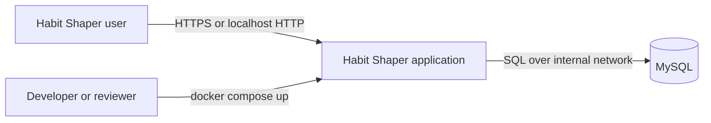
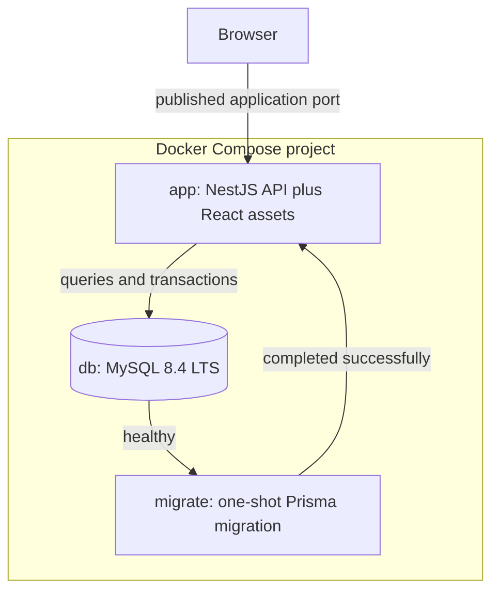
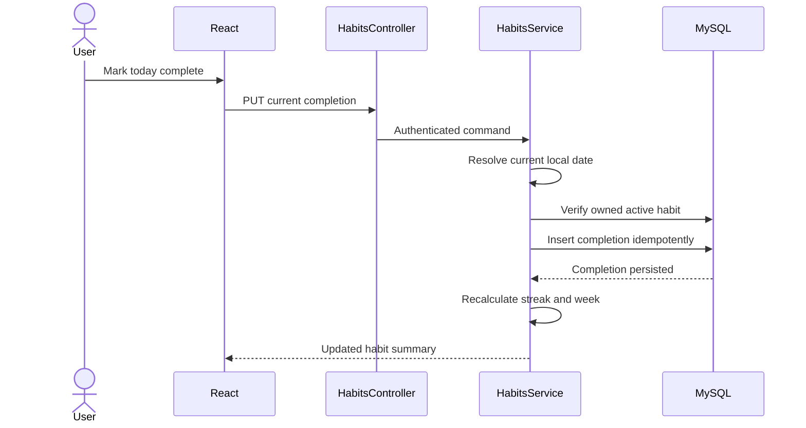
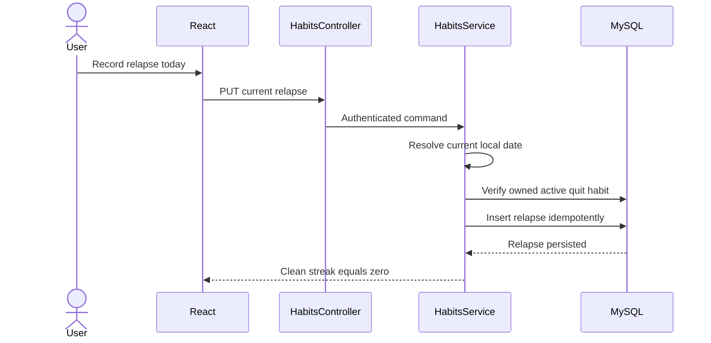
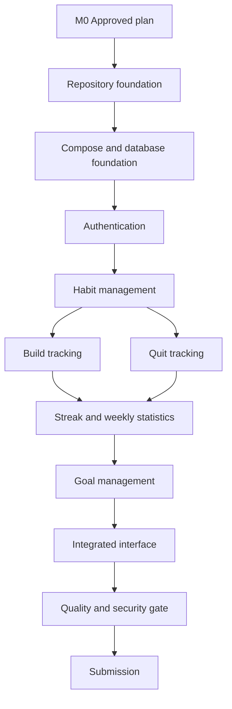

# Habit Shaper MVP

## 1. Product Definition

Habit Shaper is a lightweight web application that helps authenticated users:

- Build positive habits by recording daily completion.
- Quit unwanted habits by recording relapses and tracking clean streaks.
- Set measurable consecutive-day goals linked to their habits.

The primary product loop is:

```text
Register or log in -> create a habit -> record today's outcome -> view streak and progress
```

## 2. Terminology

| Term | Meaning | Example |
| --- | --- | --- |
| Build habit | A positive behavior the user wants to perform daily | Read every day |
| Quit habit | An unwanted behavior the user wants to stop | Stop smoking |
| Completion | The user performed a build habit today | The user read today |
| Relapse | The user performed an unwanted behavior again | The user smoked today |
| Streak | Consecutive days on which a build habit was completed | Five consecutive reading days |
| Clean streak | Consecutive days without a relapse | Seven smoke-free days |
| Goal | A consecutive-day target linked to one habit | Read for 30 consecutive days |

The interface should use **Build a positive habit** and **Quit an unwanted habit**. The internal type values may remain `BUILD` and `BREAK`.

## 3. Global Product Rules

### 3.1 Ownership and access

- Every habit, completion, relapse, and goal belongs to one authenticated user.
- A user must never be able to read or modify another user's data.
- All reads and writes must be scoped by the authenticated user's ID.

### 3.2 Calendar days and timezones

- Daily outcomes are based on the user's saved timezone.
- The backend determines the user's current local date. It must not trust a client-supplied date as proof that a day is editable.
- Exact event timestamps are stored in UTC.
- Historical completion and relapse dates remain unchanged if the user later changes timezone.

### 3.3 Historical integrity

- Users may record or undo an outcome only during the current local day.
- Past days are permanently locked after local midnight.
- Future dates cannot be recorded.
- Dates before a habit's start date cannot be recorded.
- Offline or late synchronization is outside the MVP.

These rules ensure that streaks and completion rates represent what the user recorded on the relevant day rather than a history reconstructed later.

## 4. Authentication

### 4.1 Required behavior

- Register with email and password.
- Log in with email and password.
- Log out.
- No email verification is required.
- Email addresses are normalized and unique.
- Passwords are securely hashed and never stored or logged in plaintext.
- Protected application and API routes require authentication.

## 5. Habit Building

### 5.1 Create a build habit

A build habit contains:

- Name
- Type: `BUILD`
- Start date
- Owner/user ID
- Status: active or archived
- Created and updated timestamps

Rules:

- The name is required and trimmed.
- Build habits are daily; custom schedules are outside the MVP.
- The start date is the first eligible tracking date.
- The habit type becomes immutable after creation.
- Duplicate names are allowed.
- A habit can be renamed or archived without losing its history.

### 5.2 Record daily completion

- An active build habit can be marked complete for the current local day.
- Today's completion can be undone before local midnight.
- There can be at most one completion record per habit and local date.
- Recording completion is idempotent.
- The database must enforce uniqueness for `(habit_id, completion_date)`.

Each completion stores at least:

- Habit ID
- Local completion date
- UTC creation timestamp

### 5.3 Current streak

A build streak is a sequence of consecutive completed eligible dates.

Calculation:

1. If today is complete, count backward starting from today.
2. If today is not yet complete, count backward starting from yesterday because today is not missed until it ends.
3. Stop at the first incomplete eligible date or the habit's start date.

Example:

```text
Monday    completed
Tuesday   completed
Wednesday missed
Thursday  completed

Current streak on Thursday: 1 day
```

The MVP requires the current streak. A longest-streak statistic is optional and not required for acceptance.

### 5.4 Weekly completion

- Calendar weeks run from Monday through Sunday.
- Only eligible elapsed days are included.
- Days before the habit's start date are excluded.
- Future days in the current week are excluded and must not appear as missed.

Calculations:

```text
missedDays = eligibleDays - completedDays
completionRate = completedDays / eligibleDays * 100
```

Example on Wednesday:

```text
Monday     completed
Tuesday    missed
Wednesday  completed
Thursday-Sunday excluded because they are in the future

Completed: 2 of 3
Missed: 1
Completion rate: 66.7%
```

### 5.5 Minimum build-habit interface

Each build-habit card displays:

- Habit name
- Current streak
- Current week's completed, eligible, and missed day counts
- Current week's completion percentage
- A control to mark today complete or undo today's completion

## 6. Habit Quitting

### 6.1 Create a quit habit

A quit habit contains:

- Name
- Type: `BREAK`
- Start date
- Owner/user ID
- Status: active or archived
- Created and updated timestamps

Rules:

- The start date is the first intended clean day.
- The habit type becomes immutable after creation.
- A habit can be renamed or archived without losing its history.

### 6.2 Record a relapse

- A clean streak advances automatically while no relapse is recorded.
- The user records a relapse only for the current local day.
- Today's relapse can be undone before local midnight.
- Recording a relapse immediately resets the current clean streak to zero.
- There can be at most one relapse record per habit and local date.
- Recording a relapse is idempotent.
- The database must enforce uniqueness for `(habit_id, relapse_date)`.

Each relapse stores at least:

- Habit ID
- Local relapse date
- UTC creation timestamp

All relapse events are preserved so that streaks can be derived from history rather than maintained as a mutable counter.

### 6.3 Clean-streak calculation

If no relapse has occurred:

```text
currentCleanStreak = today - startDate + 1
```

If a relapse has occurred:

```text
currentCleanStreak = today - mostRecentRelapseDate
```

Therefore:

- On the relapse date, the clean streak is `0`.
- On the following clean day, it is `1`.
- On the next clean day, it is `2`.

Example:

```text
Monday     clean day 1
Tuesday    clean day 2
Wednesday  relapse; streak 0
Thursday   clean day 1
Friday     clean day 2
```

### 6.4 Minimum quit-habit interface

Each quit-habit card displays:

- Habit name
- Current clean streak
- Start date
- A control to record today's relapse
- An undo control when today's relapse has been recorded

The interface should use neutral, supportive language. A relapse is treated as information rather than punishment.

## 7. Goal Management

### 7.1 Goal definition

An MVP goal is a consecutive-day target linked to exactly one build or quit habit.

Examples:

```text
Build habit: Read
Goal: Complete 30 consecutive days
Progress: 12 / 30 days
```

```text
Quit habit: Smoking
Goal: Remain smoke-free for 30 consecutive days
Progress: 12 / 30 clean days
```

Weekly, percentage-based, and custom-frequency goals are outside the MVP.

### 7.2 Goal data and rules

A goal contains:

- Owner/user ID
- Linked habit ID
- Positive integer target in days
- Status: active or completed
- Created and updated timestamps
- Completion timestamp when achieved

Rules:

- A user can add, edit, and remove a goal.
- Only one active goal is allowed per habit.
- Goal progress is derived automatically from the linked habit's current streak.
- Users cannot manually edit goal progress.
- Missing a build habit resets progress toward an unfinished build goal.
- Recording a relapse resets progress toward an unfinished quit goal.
- Reaching the target marks the goal completed and records its completion time.
- A completed goal remains completed even if the habit's current streak later resets.
- Only active goals can have their target edited.
- After completing a goal, the user can create a new goal for the same habit.

### 7.3 Minimum goal interface

- Create a goal by selecting one eligible habit and entering a target number of consecutive days.
- Show current progress as `current streak / target days`.
- Allow editing the target while the goal is active.
- Allow removal of an active goal.
- Clearly display completed goals as achievements.

## 8. Habit Lifecycle

- Active habits continue accumulating daily outcomes and streaks.
- Archiving a habit stops its streak from progressing and preserves its history.
- Restoring an archived habit starts a new tracking period from the restoration date while preserving earlier records.
- Hard deletion is not required for the MVP.
- When a habit is archived, its active goal is paused or hidden until the habit is restored.

## 9. Technical Constraints

- Frontend: React
- Backend: Node.js with TypeScript
- Database: MySQL
- Web-based and responsive
- Simple, clean, lightweight interface
- Entire stack starts from the repository root with:

```bash
docker compose up
```

- The root must contain `compose.yml`.
- Database schema bootstrap through migrations or seed files must run automatically on first boot.
- Running the application requires only Docker and Docker Compose.
- No local Node.js, package manager, or MySQL installation may be required.

## 10. Repository and Documentation Requirements

- Include source code, tests, documentation, configuration, migrations, and relevant development artifacts.
- Exclude `node_modules`, build output, and real secrets.
- Provide `.env.example` with placeholder values.
- Document every required environment variable in `README.md`.
- Document exact startup, shutdown, migration, seed, and test commands.
- Maintain meaningful commits that show how the application was developed.

Repository creation, collaborator invitations, publishing, and other external actions require explicit user authorization and are not performed merely because they appear in the source brief.

## 11. Out of Scope

- Email verification
- Password reset
- Social login
- Reminders and notifications
- Social or community features
- Badges and gamification beyond completed goals
- Native mobile applications
- Custom habit schedules or frequencies
- Retroactive outcome editing
- Offline or late synchronization
- Weekly or percentage-based goals
- Advanced analytics and longest-streak dashboards

## 12. MVP Acceptance Criteria

The MVP is complete when all of the following are true:

1. A user can register, log in, log out, and access only their own data.
2. A user can create and view daily build and quit habits.
3. A user can mark or undo today's build completion, but cannot rewrite a past or future date.
4. Build streaks remain active during an unchecked current day and break after a missed day closes.
5. Weekly build statistics correctly report eligible, completed, and missed days without counting future days.
6. A user can record or undo today's relapse, but cannot rewrite a past or future relapse date.
7. A relapse resets the clean streak to zero, and the next clean day begins at one.
8. Duplicate completion and relapse records are prevented at both application and database levels.
9. Date calculations remain correct around midnight in the user's timezone.
10. A user can add, edit, and remove an active consecutive-day goal linked to one habit.
11. Goal progress is derived from the linked habit's streak and cannot be manually manipulated.
12. Reaching a goal permanently records it as completed.
13. Archiving a habit preserves its outcomes and goal history.
14. The complete system starts successfully with one `docker compose up` command from the repository root.
15. Schema initialization occurs automatically on first boot.
16. The repository contains safe configuration examples and complete startup documentation without real secrets.


# Habit Shaper Architecture

**Status:** Accepted for MVP implementation  
**Last updated:** 2026-09-01  
**Decision owner:** Project developer  
**Decision horizon:** Coding-test MVP and its first production-like deployment

## 1. Purpose

This document defines the technical architecture for Habit Shaper. It explains the system shape, component responsibilities, dependency rules, runtime behavior, data authority, deployment model, failure handling, testing strategy, and the tradeoffs behind the selected stack.

The product requirements and behavioral acceptance criteria are defined separately in `MVP.md`.

## 2. Context and Constraints

Habit Shaper is a lightweight web application for authenticated users to:

- Build positive habits through same-day completion tracking.
- Quit unwanted habits through same-day relapse tracking.
- View streaks and weekly completion statistics.
- Create consecutive-day goals linked to habits.

Hard technical constraints from the coding brief:

- The frontend uses React.
- The backend uses Node.js with TypeScript.
- The database is MySQL.
- Authentication uses email and password without email verification.
- The complete application starts with `docker compose up` from the repository root.
- Docker and Docker Compose are the only required host tools.
- Schema initialization runs automatically on first boot.
- The repository contains no real secrets, local dependency directories, or build artifacts.

Scale, multi-region availability, regulatory requirements, and independent team ownership are not specified. This architecture does not invent those requirements.

## 3. Architectural Drivers

| Driver | Classification | Priority | Evidence |
| --- | --- | --- | --- |
| Complete end-to-end behavior | Business outcome | Must preserve | Explicit coding-test criterion |
| One-command startup | Technical constraint | Must preserve | Explicit coding-test requirement |
| Correct date and streak behavior | User expectation | Must preserve | Core product behavior |
| User data isolation | Security requirement | Must preserve | Implied by authenticated personal data |
| Readable and reviewable code | Team constraint | Must preserve | Explicit code-quality criterion |
| Simple operations | Operational need | Enabling | Lightweight-product requirement |
| Visible development history | Delivery constraint | Enabling | Explicit Git-history criterion |
| Independent service scaling | Operational need | Deferrable | No evidence of need |
| Kubernetes deployment | Platform option | Deferrable | Not required by the brief |

## 4. Quality Scenarios

| ID | Stimulus | Boundary | Required response | Evidence |
| --- | --- | --- | --- | --- |
| Q1 | A reviewer clones the repository and runs `docker compose up` | Deployment | Database becomes ready, migrations complete, and the app becomes healthy without local runtimes | Compose smoke test from a clean environment |
| Q2 | An authenticated user marks today's build habit complete twice | API and database | One completion exists and both requests resolve consistently | API integration test plus unique database constraint |
| Q3 | A user attempts to edit yesterday's outcome | Domain policy | The request is rejected and historical data remains unchanged | Boundary-date integration tests |
| Q4 | Two users request the same habit identifier | Authorization | Only the owner can read or modify the habit | Cross-user integration tests |
| Q5 | The application starts while MySQL is still initializing | Deployment | Migration and app services wait on actual readiness without fixed sleeps | Compose health and dependency checks |
| Q6 | Today has not yet been completed | Streak calculation | Yesterday's active build streak remains visible until the current local day closes | Clock-controlled unit tests |
| Q7 | A relapse is recorded today | Quit-habit policy | Clean streak becomes zero atomically and the next clean day begins at one | Unit and integration tests |
| Q8 | A migration fails | Startup | The app does not start against an unknown schema and logs expose the failure | Deliberately failing migration test |

## 5. Architecture Decision

Habit Shaper uses a **modular monolith** with one deployable application image and one MySQL database.

The application image contains:

- A React single-page application compiled into static files.
- A NestJS REST API.
- Prisma Client and migration tooling.

At runtime, NestJS serves both the REST API and the compiled React application. MySQL is the only stateful service.

### 5.1 System context



### 5.2 Runtime containers



Only the application port is published to the host. MySQL is reachable only through the Compose network.

## 6. Technology Stack

| Area | Choice | Responsibility |
| --- | --- | --- |
| Runtime | Node.js 24 LTS | Executes build tooling and the backend |
| Language | TypeScript in strict mode | Compile-time safety across both applications |
| Workspace | pnpm workspaces | Dependency and script orchestration |
| Frontend | React 19.2 and Vite 8 | Browser interface and production asset build |
| Routing | React Router | Client-side route composition |
| Server state | TanStack Query v5 | API queries, mutations, caching, and invalidation |
| Forms | React Hook Form | Form state and submission behavior |
| Styling | Tailwind CSS v4 | Small, consistent, responsive UI system |
| Backend | NestJS 12 with Express adapter | REST transport, dependency injection, guards, and validation |
| API description | OpenAPI through `@nestjs/swagger` | Reviewable API contract and generated client types |
| ORM | Prisma 7 | Type-safe database access and committed migrations |
| Database | MySQL 8.4 LTS with InnoDB | Authoritative durable state |
| Time handling | Luxon behind an application clock | IANA-timezone and calendar-date calculations |
| Password hashing | Argon2id | Password verification and storage protection |
| Unit testing | Vitest or the Nest-compatible project test runner | Domain and component behavior |
| End-to-end testing | Playwright | Browser-level critical journeys |
| Packaging | Multi-stage Docker build | Reproducible application image |
| Local orchestration | Docker Compose v2 | Required one-command runtime |

NestJS is selected instead of plain Fastify because its module, provider, guard, pipe, and testing conventions align with the likely reviewer environment. The default Express adapter avoids adapter-specific compatibility work that provides no material MVP benefit.

## 7. Logical Boundaries and Ownership

### 7.1 Frontend boundaries

Frontend dependencies flow in one direction:

```text
shared -> features -> app
```

- `shared` contains generic UI primitives, HTTP infrastructure, configuration, and generic utilities.
- `features` contains auth, habits, and goals code, including its components, queries, mutations, schemas, and hooks.
- `app` owns routing, global providers, layouts, page composition, and error boundaries.
- A feature does not import another feature directly. The app layer composes them.
- External code imports a feature only through its `index.ts` public API.
- Server state belongs to TanStack Query; transient presentation state remains local to components.
- The frontend never calculates authoritative streaks, dates, ownership, or goal completion.

### 7.2 Backend boundaries

Backend request flow:

```text
Request
  -> guard and validation
  -> controller
  -> application service
  -> pure domain policy and Prisma
  -> MySQL transaction
  -> response DTO
```

Backend modules:

| Module | Owns | Does not own |
| --- | --- | --- |
| `AuthModule` | Registration, login, logout, session creation and revocation | Habit or goal policy |
| `UsersModule` | User lookup and profile timezone | Authentication transport |
| `HabitsModule` | Habits, completions, relapses, streaks, and weekly statistics | Goal lifecycle |
| `GoalsModule` | Goal creation, progress, completion, editing, and removal | Independent streak calculations |
| `DatabaseModule` | Prisma lifecycle and database connectivity | Business rules |
| `HealthModule` | Process and database readiness reporting | Repair or migration logic |

Controllers handle HTTP concerns only. Application services enforce ownership, coordinate transactions, and invoke domain calculations. Pure domain calculation files import neither NestJS nor Prisma.

`GoalsModule` obtains habit progress through a narrow service exported by `HabitsModule`; it does not bypass the module to reconstruct streak rules independently.

### 7.3 API contract boundary

The backend is the contract authority:

```text
NestJS DTOs
  -> generated OpenAPI document
  -> generated TypeScript API client
  -> frontend feature API functions
```

Generated client files are not manually edited. Prisma models and generated database types are never imported by the frontend.

## 8. Source Layout

```text
habit-shaper/
├── apps/
│   ├── web/
│   │   ├── src/
│   │   │   ├── app/
│   │   │   │   ├── layouts/
│   │   │   │   ├── pages/
│   │   │   │   ├── providers/
│   │   │   │   └── router/
│   │   │   ├── features/
│   │   │   │   ├── auth/
│   │   │   │   ├── habits/
│   │   │   │   └── goals/
│   │   │   ├── shared/
│   │   │   │   ├── api/
│   │   │   │   ├── components/
│   │   │   │   ├── config/
│   │   │   │   ├── lib/
│   │   │   │   └── styles/
│   │   │   ├── test/
│   │   │   └── main.tsx
│   │   ├── package.json
│   │   ├── tsconfig.json
│   │   └── vite.config.ts
│   │
│   └── api/
│       ├── prisma/
│       │   ├── migrations/
│       │   ├── schema.prisma
│       │   └── seed.ts
│       ├── src/
│       │   ├── auth/
│       │   ├── users/
│       │   ├── habits/
│       │   │   ├── domain/
│       │   │   └── dto/
│       │   ├── goals/
│       │   │   ├── domain/
│       │   │   └── dto/
│       │   ├── database/
│       │   ├── health/
│       │   ├── common/
│       │   ├── config/
│       │   ├── app.module.ts
│       │   └── main.ts
│       ├── test/
│       ├── nest-cli.json
│       ├── package.json
│       └── prisma.config.ts
│
├── packages/
│   └── api-client/
├── tests/
│   └── e2e/
├── docs/
│   └── decisions/
├── scripts/
├── .github/
│   └── workflows/
├── compose.yaml
├── compose.dev.yaml
├── Dockerfile
├── .env.example
├── package.json
├── pnpm-lock.yaml
├── pnpm-workspace.yaml
├── tsconfig.base.json
└── README.md
```

Prisma is colocated with `apps/api` because the backend owns the database schema, migrations, and query behavior.

## 9. Data Authority

MySQL is authoritative for all durable product state. No frontend cache is authoritative.

| Fact | Authoritative writer | Derived values | Integrity control |
| --- | --- | --- | --- |
| User identity and timezone | `AuthModule` and `UsersModule` | Current local date | Unique normalized email |
| Session | `AuthModule` | Authenticated request principal | Hashed token, expiry, revocation |
| Habit | `HabitsModule` | Display status | Owner foreign key and immutable type |
| Build completion | `HabitsModule` | Build streak and weekly statistics | Unique habit and local-date pair |
| Relapse | `HabitsModule` | Clean streak | Unique habit and local-date pair |
| Goal | `GoalsModule` | Progress from current streak | One active goal per habit |
| Goal achievement | `GoalsModule` | Completed-goal display | Completion recorded permanently |

Expected conceptual entities:

```text
User
  ├── Session
  ├── Habit
  │    ├── Completion
  │    ├── Relapse
  │    └── Goal
  └── timezone
```

The exact Prisma schema and API representations are implementation-owned details, but they must preserve the ownership and uniqueness invariants above.

## 10. Authentication and Authorization

Authentication uses an opaque database-backed session rather than JWT.

### 10.1 Registration

1. Validate and normalize the email address.
2. Validate the password policy.
3. Hash the password with Argon2id.
4. Insert the user, rejecting an existing normalized email.
5. Create a cryptographically random session token.
6. Store only the token hash with user ID, expiry, and timestamps.
7. Return the plaintext token only in an `HttpOnly` cookie.

### 10.2 Authenticated request

1. Read the session cookie.
2. Hash the received token.
3. Find an unexpired, non-revoked session.
4. Attach the authenticated principal to the request.
5. Scope every resource query by both resource ID and authenticated user ID.

Cookie policy:

```text
HttpOnly
SameSite=Lax
Secure in production
Path=/
```

Logout revokes or deletes the current session and expires the browser cookie. Passwords and session tokens are never logged.

Authorization is enforced server-side. Hiding a frontend control is not an authorization mechanism.

## 11. Time and Calendar Authority

Date correctness is a domain concern because streaks depend on calendar-day boundaries.

- The user's saved IANA timezone determines the current local date.
- The backend calculates that date through an injectable clock abstraction.
- Clients cannot choose which historical date is editable.
- Exact event timestamps are stored in UTC.
- Completion and relapse records also store their authoritative local calendar date.
- A timezone change affects future events only; it does not rewrite historical local dates.
- Unit tests replace the system clock with a deterministic fake clock.

Historical integrity rule:

```text
current local date -> record or undo allowed
past local date    -> permanently locked
future local date  -> rejected
```

## 12. Core Runtime Flows

### 12.1 Record build completion



The database uniqueness constraint is the final duplicate-write defense. A second identical request returns the same logical result.

### 12.2 Record relapse



### 12.3 Complete a goal

Goal progress is derived from the linked habit's current streak. When a streak first reaches the active goal target, the backend records goal completion in the same request transaction that produces the updated result. A later missed day or relapse does not erase the completed achievement.

No asynchronous queue or eventual-consistency mechanism is required for the MVP.

## 13. Transaction and Consistency Rules

- User registration and initial session creation are one logical operation; partial failure must not expose an unusable authenticated state.
- Recording a completion or relapse is atomic at the database level.
- Duplicate same-day writes are idempotent within `(habit_id, local_date)`.
- Ownership is verified within the same request that performs the mutation.
- Goal completion is recorded transactionally with the state transition that establishes completion when practical.
- Read-after-write responses are calculated from committed state.
- No state-changing transaction remains open across an external network call.

MySQL remains the single consistency boundary. There are no queues, replicas, or distributed transactions in the MVP.

## 14. Error Contract

The API returns a stable JSON error envelope:

```json
{
  "error": {
    "code": "HABIT_DATE_LOCKED",
    "message": "Past habit outcomes cannot be changed.",
    "requestId": "..."
  }
}
```

Error categories:

| Category | HTTP behavior | Example |
| --- | --- | --- |
| Validation | `400` | Invalid email or target days |
| Authentication | `401` | Missing or expired session |
| Authorization or hidden ownership | `404` where appropriate | Another user's habit ID |
| Conflict | `409` | Duplicate email or active goal |
| Domain policy | `422` or documented `409` | Past date is locked |
| Unexpected dependency failure | `500` or `503` | Database unavailable |

Unexpected errors are logged with request IDs. Responses never expose stack traces, SQL, secrets, password hashes, or session tokens.

## 15. Deployment and Startup

### 15.1 Compose services

| Service | Lifecycle | Published port | Durable state |
| --- | --- | --- | --- |
| `db` | Long running | None | Named MySQL volume |
| `migrate` | One-shot | None | Writes schema migrations to MySQL |
| `app` | Long running | Application port only | Stateless container filesystem |

Startup behavior:

1. Compose starts MySQL.
2. The MySQL health check verifies actual database readiness.
3. The migration service runs `prisma migrate deploy` using the application image.
4. Migration failure prevents application startup.
5. The application starts after successful migration.
6. The application health endpoint verifies process and database readiness.

`depends_on` without a health condition is insufficient. Fixed sleep scripts are prohibited.

### 15.2 Image build

The root Dockerfile is a multi-stage build:

```text
dependency stage
  -> frontend build stage
  -> backend build stage
  -> minimal runtime stage
```

The runtime image contains production dependencies, compiled NestJS output, React static assets, and the migration artifacts required by the `migrate` service. It runs as a non-root user where supported by the selected image and file permissions.

### 15.3 Configuration

- `.env.example` documents all required variables with placeholders.
- Configuration is validated at application startup.
- Missing required variables cause a clear fail-fast error.
- Real `.env` files, certificates, and keys are excluded from Git.
- MySQL uses a dedicated application user rather than the root account.

## 16. Failure Behavior and Recovery

| Failure | Detection | User-visible behavior | Recovery |
| --- | --- | --- | --- |
| MySQL not ready | Database health check | App does not start prematurely | Compose waits for health |
| Migration failure | Non-zero migration exit | App remains stopped | Fix migration and restart Compose |
| Database unavailable after startup | Query failure and readiness check | API returns a controlled service error | Restore DB; app reconnects through Prisma/driver behavior |
| Duplicate completion or relapse request | Unique constraint or existing record | Same logical success result | No reconciliation required |
| Expired session | Session lookup | `401`, frontend returns to login | User logs in again |
| Invalid or hostile input | Validation pipe | Structured client error | User corrects input |
| Frontend asset route refresh | Static fallback | React application loads instead of `404` | Nest serves `index.html` for non-API routes |
| Process restart | Container restart | Brief unavailability | Stateless app resumes from MySQL state |

Named database volumes survive ordinary `docker compose down`. Removing volumes is a deliberate destructive operation and is not part of standard instructions.

## 17. Observability

The MVP uses proportional observability:

- Structured JSON application logs.
- A request ID attached to logs and error responses.
- Request method, route template, status, and duration.
- Authentication failures without logging credentials.
- Startup, migration, and database connectivity events.
- Health endpoint for Compose and smoke tests.

Metrics aggregation, distributed tracing infrastructure, and external dashboards are deferred because the MVP has one application process and no evidence of a production observability platform requirement.

## 18. Testing Strategy

### 18.1 Unit tests

Pure tests cover:

- Build streak calculation.
- Clean streak calculation.
- Weekly eligible, completed, and missed days.
- Current-day versus locked historical dates.
- Timezone and midnight boundaries.
- Goal progress and permanent completion.

### 18.2 Backend integration tests

Integration tests cover:

- Registration, login, logout, and session expiry.
- Cross-user resource isolation.
- Same-day completion and relapse idempotency.
- Database uniqueness constraints.
- Past and future date rejection.
- Transaction rollback on failure.
- OpenAPI generation.

### 18.3 Frontend tests

Component tests cover form errors, loading states, mutation states, and accessible interactions. API behavior is mocked at the network boundary rather than by mocking internal hooks.

### 18.4 End-to-end tests

Playwright covers the minimum user journeys:

1. Register and log in.
2. Create and complete a build habit.
3. Create a quit habit and record a relapse.
4. Create, edit, progress, and remove a goal.
5. Log out and confirm protected routes are unavailable.

### 18.5 Deployment tests

- `docker compose config --quiet`
- Clean-image build.
- Clean-volume first boot.
- Migration success.
- Health endpoint readiness.
- Browser smoke test against the published port.

## 19. CI and Optional Delivery Infrastructure

The minimum CI pipeline is:

```text
install
  -> lint
  -> type-check
  -> unit tests
  -> integration tests
  -> production build
  -> Compose smoke test
  -> container vulnerability scan
```

Jenkins may implement this pipeline if it matches the reviewer's environment. CI is not required to run the application locally.

Kind, Argo CD, Kubernetes, a container registry, and Envoy Gateway are optional bonus infrastructure. They must not replace or complicate the mandatory Compose path. If later implemented, the correct GitOps flow is:

```text
application repository
  -> Jenkins builds, tests, scans, and pushes an image
  -> Jenkins updates a GitOps repository image reference
  -> Argo CD observes the GitOps repository
  -> Argo CD reconciles the Kubernetes cluster
  -> Envoy Gateway routes traffic to Habit Shaper
```

## 20. Security Baseline

- Argon2id password hashing.
- Opaque sessions stored as token hashes.
- `HttpOnly`, `SameSite=Lax`, and production `Secure` cookies.
- Server-side authorization for every owned resource.
- DTO validation and response shaping.
- Parameterized database access through Prisma.
- No secrets in Git, logs, images, or error responses.
- Dependency and image vulnerability scanning in CI.
- Security headers appropriate to the single-origin application.
- Rate limiting on registration and login endpoints.

A formal threat model and production secret-management system are separate specialist tasks if the application moves beyond the coding-test environment.

## 21. Architecture Fitness Checks

| Architecture claim | Automated or review evidence | Failure action |
| --- | --- | --- |
| One-command startup | Clean `docker compose up` smoke test | Block delivery |
| Database readiness precedes migration | Compose configuration and first-boot test | Fix health/dependency model |
| Historical outcomes are immutable | Domain and API boundary tests | Block merge |
| Users are isolated | Cross-user integration test suite | Block merge |
| Frontend dependency direction is preserved | ESLint restricted-import rules | Block merge |
| Features expose public APIs only | ESLint deep-import rules | Block merge |
| Domain calculations are framework-independent | Import-boundary test or review | Refactor before merge |
| API and client types agree | Regenerate OpenAPI client and require clean Git diff | Block merge |
| Schema matches committed migrations | Migration from an empty database | Block delivery |
| Images contain no development-only artifacts | Image inspection and vulnerability scan | Rebuild image |

## 22. Alternatives and Tradeoffs

### 22.1 Modular monolith versus microservices

**Selected:** Modular monolith.

Benefits:

- One owner, one deployment, and one transactional boundary.
- Lower cognitive and operational cost.
- Direct fit for the coding-test scope.

Accepted costs:

- Frontend and API deployments are coupled.
- Independent scaling is unavailable.

Microservices are rejected because there is no independent ownership, scaling, failure-isolation, or release requirement that compensates for distributed transactions and operational overhead.

### 22.2 Combined application container versus separate web container

**Selected:** NestJS serves the compiled React application.

Benefits:

- One public origin and no CORS configuration.
- Simpler authentication cookies.
- Fewer containers and configuration files.

Accepted cost:

- Static assets and the API deploy together.

A separate Nginx or web container can be introduced later if measured traffic or deployment independence justifies it.

### 22.3 NestJS versus plain Fastify

**Selected:** NestJS with its default Express adapter.

Benefits:

- Familiar modules, providers, guards, pipes, and testing conventions.
- Strong alignment with the likely reviewer's backend stack.
- Explicit structure for code-quality evaluation.

Accepted costs:

- More framework boilerplate than plain Fastify.
- Dependency injection and decorator conventions must be used consistently.

### 22.4 Database sessions versus JWT

**Selected:** Opaque database-backed sessions.

Benefits:

- Simple revocation, logout, and expiry.
- Well matched to a same-origin application.
- No refresh-token lifecycle.

Accepted cost:

- Each authenticated request performs or caches a session lookup.

JWT can be reconsidered only if stateless cross-service authentication or external API consumers become real requirements.

### 22.5 Compose versus mandatory Kubernetes

**Selected:** Docker Compose is mandatory; Kubernetes is optional.

Compose directly satisfies the brief. Mandatory Kubernetes would increase prerequisites and violate the intended one-command reviewer experience.

## 23. Evolution Path

Evolution happens only when evidence changes a driver:

1. Implement and verify the modular monolith.
2. Measure actual bottlenecks and change frequency.
3. Add a separate static frontend deployment only if independent deployment or asset traffic requires it.
4. Add Redis only if measured session or caching requirements justify another stateful dependency.
5. Introduce background jobs only for a real asynchronous workflow such as reminders.
6. Consider Kubernetes only when the target environment requires cluster deployment.
7. Consider service extraction only when a module has independent ownership, scaling, deployment, and recoverable failure behavior.

Any future extraction must preserve data authority, authorization, date policy, idempotency, and migration compatibility. The current monolith remains the default until those benefits are evidenced.

## 24. Open Questions and Evidence Gaps

- The final hosting environment is unknown.
- Expected user count and traffic are unknown.
- The reviewer's exact NestJS, testing, and CI conventions are unknown.
- Production secret storage and TLS termination are outside the supplied requirements.
- Backup, restore, RTO, and RPO expectations are not specified.
- Accessibility targets beyond sound web practice are not explicitly stated.

These gaps do not block the MVP. They must be resolved before claiming production readiness beyond the coding-test context.

## 25. Decision Summary

The approved architecture is a TypeScript modular monolith consisting of a React SPA, a NestJS REST API, Prisma, and MySQL. NestJS serves the compiled frontend, MySQL owns all durable state, and Docker Compose orchestrates database readiness, one-shot migrations, and application startup. Business rules remain backend-authoritative and framework-independent where practical. Automated tests enforce ownership, historical integrity, timezone correctness, module boundaries, migration reproducibility, and one-command startup.


# Habit Shaper Development Plan and Delivery Story

**Status:** Approved plan, implementation not started  
**Last updated:** 2026-09-01  
**Product decision owner:** Project developer  
**Implementation owner:** Project developer with coding-agent assistance  
**Source requirements:** Coding-test brief, `MVP.md`, and `architecture.md`

## 1. Purpose

This document is the operating plan for developing and submitting Habit Shaper. It describes the intended development story from product understanding through repository handoff. It also acts as the task-management source of truth during implementation.

The document is designed to answer five questions at any point in the project:

1. What outcome are we building toward?
2. What has been decided and why?
3. What task is currently in progress?
4. What evidence proves a task is complete?
5. Does the repository tell a credible story to the reviewer?

Product behavior belongs in `MVP.md`. System design belongs in `architecture.md`. This file owns execution order, task status, dependencies, verification, Git history, and submission readiness.

## 2. Project Vision

Habit Shaper should feel small, trustworthy, and complete.

The user should be able to register, create a habit, record today's outcome, and immediately understand their progress. A build habit records a positive behavior completed today. A quit habit advances automatically while the unwanted behavior is avoided and resets when a relapse is recorded. Goals turn those streaks into measurable milestones.

The engineering vision is equally important:

- The product rules are explicit rather than implied by UI behavior.
- Historical tracking data cannot be rewritten after the day closes.
- The backend is authoritative for ownership, dates, streaks, statistics, and goals.
- The frontend is clean, responsive, accessible, and focused on the daily action.
- The repository starts with one `docker compose up` command.
- Every meaningful development step is visible through code, tests, documents, decisions, and Git history.
- Coding-agent output is reviewed, corrected, and verified rather than accepted blindly.

The goal is not to demonstrate the largest possible stack. The goal is to demonstrate product judgment, technical correctness, delivery discipline, and complete end-to-end execution.

## 3. Success Definition

The project succeeds when a reviewer can:

1. Clone the private repository.
2. Run `docker compose up --build` from the repository root.
3. Wait for MySQL readiness and automatic migrations.
4. Open the application in a browser.
5. Register and log in.
6. Create build and quit habits.
7. Record today's completion or relapse.
8. See correct streak and weekly progress calculations.
9. Create and complete a consecutive-day goal.
10. Inspect readable code, focused tests, meaningful commits, and documented agentic development.

Completion is based on evidence, not a claim that the application is done.

## 4. Approved Scope

### 4.1 Included

- Email/password registration, login, and logout.
- Database-backed opaque sessions.
- User timezone storage and backend calendar authority.
- Daily build habits.
- Same-day build completion and undo.
- Build streak calculation.
- Weekly eligible, completed, and missed-day statistics.
- Quit habits.
- Same-day relapse recording and undo.
- Clean-streak calculation.
- Consecutive-day goals linked to habits.
- Goal add, edit, remove, progress, and permanent completion.
- Habit rename and archive behavior needed for safe lifecycle management.
- Responsive React interface.
- NestJS REST API.
- MySQL persistence through Prisma.
- Automatic first-boot migrations.
- Docker Compose execution from the repository root.
- Unit, integration, and critical end-to-end tests.
- README, architecture, product, agentic-development, and submission documentation.

### 4.2 Excluded

- Email verification and password reset.
- Social login.
- Reminders and notifications.
- Social or community features.
- Native mobile clients.
- Retroactive completion or relapse editing.
- Custom habit schedules.
- Weekly or percentage-based goals.
- Offline synchronization.
- Redis, queues, microservices, CQRS, and event sourcing.
- Mandatory Kubernetes, Argo CD, Envoy Gateway, or cloud deployment.
- Advanced analytics beyond the required streak and weekly statistics.

Any excluded item requires an explicit scope decision before it enters the task board.

## 5. Technical Baseline

| Area | Decision |
| --- | --- |
| Architecture | Modular monolith |
| Frontend | React 19.2, Vite 8, TypeScript |
| Backend | NestJS 12 with Express adapter |
| Database | MySQL 8.4 LTS with Prisma 7 |
| Authentication | Argon2id passwords and opaque database sessions |
| API | REST JSON with DTO validation and OpenAPI |
| Styling | Tailwind CSS v4 |
| Server state | TanStack Query v5 |
| Forms | React Hook Form |
| Time | Backend IANA-timezone handling behind an injectable clock |
| Workspace | pnpm workspaces |
| Packaging | Multi-stage Dockerfile |
| Required orchestrator | Root `compose.yml` |
| Tests | Unit, API integration, database integration, and Playwright E2E |

The exact root Compose filename is `compose.yml` because that is what the coding brief explicitly requests.

## 6. Stakeholders and Responsibilities

| Role | Responsibility | Authority |
| --- | --- | --- |
| Project developer | Product decisions, implementation, verification, repository ownership, and submission | Final decision maker |
| Coding agent | Analysis, planning, code generation, test generation, review assistance, and documentation drafts | No independent product or external-action authority |
| Reviewer | Evaluates agentic development, code quality, completeness, and Git history | Submission evaluator |
| GitHub | Hosts the private repository and collaborator invitation | External dependency |
| Docker runtime | Executes the reviewer-facing application environment | External runtime dependency |

External actions such as creating the repository, pushing code, or inviting the reviewer happen only after explicit developer authorization.

## 7. Development Principles

### 7.1 Build vertical slices

Prefer an end-to-end capability over isolated horizontal layers.

Good slice:

```text
Register form
  -> registration endpoint
  -> password hashing
  -> user persistence
  -> session cookie
  -> integration test
```

Avoid considering registration complete after creating only the database model or only the form.

### 7.2 Keep business policy explicit

Rules such as same-day editing, streak boundaries, ownership, and goal completion belong in testable backend policy. They must not be implied solely by disabled frontend controls.

### 7.3 Keep one source of truth

- MySQL is authoritative for durable state.
- The backend is authoritative for dates and calculated progress.
- `MVP.md` is authoritative for product behavior.
- `architecture.md` is authoritative for technical boundaries.
- This document is authoritative for task status and delivery order.

### 7.4 Verify before claiming completion

A task cannot move to `DONE` because code exists. Its acceptance commands must pass, its diff must be reviewed, and its evidence must be recorded.

### 7.5 Preserve the development story

Commit each logical capability with its tests and related documentation. Do not collapse the entire project into a single final commit.

## 8. Task Management Model

### 8.1 Task states

| State | Meaning |
| --- | --- |
| `BACKLOG` | Useful work that is not yet ready to start |
| `READY` | Scope, dependencies, and acceptance criteria are clear |
| `IN_PROGRESS` | Actively being implemented; one accountable owner |
| `IN_REVIEW` | Implementation finished; tests, diff, and behavior being checked |
| `BLOCKED` | Cannot proceed because a named dependency or decision is unavailable |
| `DONE` | Acceptance evidence exists and related documentation is current |

### 8.2 Work-in-progress limit

- Maximum one primary implementation task in `IN_PROGRESS`.
- One review or documentation task may run alongside it.
- Do not start another feature while the current feature lacks tests or integration evidence.

This limit protects the Git story and prevents half-finished features from accumulating.

### 8.3 Definition of Ready

A task is `READY` only when:

- Its user or engineering outcome is stated.
- Included and excluded behavior is clear.
- Dependencies are satisfied or named.
- Acceptance criteria are testable.
- Required product decisions are resolved.
- The intended commit scope is known.
- No unapproved external action is hidden inside it.

### 8.4 Definition of Done

A task is `DONE` only when:

- The requested behavior works end to end where applicable.
- Ownership and authorization are enforced.
- Input and output validation are present.
- Relevant unit and integration tests pass.
- Type checking, linting, and formatting pass.
- The implementation follows module-boundary rules.
- Error and loading behavior are handled.
- No real secret or generated build output is introduced.
- Related product, architecture, API, or README documentation is updated.
- Agent-generated work has been reviewed by the developer.
- The diff contains only the task's logical change.
- A meaningful commit or PR records the result.

### 8.5 Task record template

Use this template when adding or expanding a task:

```md
### TASK-ID: Short task name

- Status:
- Owner:
- Outcome:
- In scope:
- Out of scope:
- Hard dependencies:
- Acceptance criteria:
- Verification commands:
- Evidence artifact:
- Agent contribution:
- Human decisions:
- Intended commit:
- Risks or notes:
```

## 9. Current Project Board

This is the status at the time this plan is created.

### Done

- [x] `DISC-001` Read and extract the complete coding-test brief.
- [x] `DISC-002` Define build, quit, relapse, streak, and goal terminology.
- [x] `DISC-003` Resolve historical tracking integrity: only today is editable.
- [x] `DISC-004` Define streak-based MVP goals.
- [x] `SPEC-001` Create the approved MVP specification.
- [x] `ARCH-001` Select the modular-monolith architecture.
- [x] `ARCH-002` Select React, NestJS, Prisma, MySQL, and Compose stack.
- [x] `ARCH-003` Define frontend and backend module boundaries.
- [x] `ARCH-004` Create the architecture document.
- [x] `PLAN-001` Define the submission and evaluation strategy.
- [x] `PLAN-002` Create this delivery and task-management plan.

### Ready

- [ ] `REPO-001` Initialize the pnpm monorepo and repository controls.
- [ ] `DOC-001` Move approved planning documents into the repository `docs/` directory.
- [ ] `FOUND-001` Create the application and database Compose foundation.

### Backlog

- [ ] All implementation, verification, CI, and submission tasks listed below.

### Blocked by external input

- [ ] `SUB-002` Invite the reviewer; blocked until the reviewer identity is provided.
- [ ] `SUB-001` Create or connect the private GitHub repository; requires explicit authorization and repository name.

## 10. Milestones

| Milestone | Outcome | Exit gate |
| --- | --- | --- |
| M0 - Approved plan | Scope, architecture, and delivery process are recorded | Planning documents approved |
| M1 - Reproducible foundation | Empty application boots through `compose.yml` with automatic migrations | Clean-volume Compose smoke test passes |
| M2 - Authenticated product shell | User can register, log in, remain authenticated, and log out | Auth API and browser tests pass |
| M3 - Habit management | User can create, view, rename, and archive owned build and quit habits | Cross-user and lifecycle tests pass |
| M4 - Daily tracking | Build completion and relapse flows enforce same-day integrity | Clock and idempotency tests pass |
| M5 - Progress | Correct build streaks, clean streaks, and weekly completion data are displayed | Calculation and integrated UI tests pass |
| M6 - Goals | User can manage and complete streak-based goals | Goal lifecycle tests pass |
| M7 - Product-quality candidate | UI, errors, accessibility, tests, docs, and CI meet the release gate | Full local and CI verification passes |
| M8 - Submission | Private repository is clean, runnable, documented, and shared with reviewer | Fresh-clone rehearsal and invitation verification pass |

## 11. Work Breakdown

Relative size indicates complexity, not a calendar commitment. No deadline was supplied, so the plan does not invent dates.

### Phase A: Repository and planning foundation

#### REPO-001: Initialize the monorepo

- **Status:** `READY`
- **Size:** S
- **Outcome:** A clean pnpm workspace supports the React app, NestJS app, shared API client, root quality commands, and reproducible dependency installation.
- **Deliverables:** Root `package.json`, `pnpm-workspace.yaml`, lockfile, base TypeScript configuration, ESLint, Prettier, EditorConfig, `.gitignore`, and `.dockerignore`.
- **Dependencies:** M0.
- **Acceptance:** A clean dependency install succeeds; root lint, type-check, and test commands resolve all workspaces.
- **Intended commit:** `chore: initialize pnpm monorepo`

#### DOC-001: Install approved documentation in the repository

- **Status:** `READY`
- **Size:** S
- **Outcome:** The repository begins with an inspectable product and architecture baseline.
- **Deliverables:** `docs/MVP.md`, `docs/architecture.md`, this plan, and initial decision records.
- **Dependencies:** REPO-001.
- **Acceptance:** Documents use the exact root filename `compose.yml`, agree on the stack, and contain no private local paths.
- **Intended commit:** `docs: add product architecture and delivery plan`

#### REPO-002: Establish branch and commit controls

- **Status:** `BACKLOG`
- **Size:** S
- **Outcome:** Future changes use consistent branches, Conventional Commits, and pre-commit quality checks.
- **Deliverables:** Commit convention in `CONTRIBUTING.md`, lightweight hooks where appropriate, and CI-aligned root scripts.
- **Dependencies:** REPO-001.
- **Acceptance:** A sample branch can run the same quality commands used by CI; hooks do not require a host Node installation for reviewer startup.
- **Intended commit:** `chore(repo): add contribution and commit conventions`

### Phase B: Containerized foundation

#### FOUND-001: Scaffold React and NestJS applications

- **Status:** `READY`
- **Size:** M
- **Outcome:** Both applications compile within the monorepo and observe the approved feature boundaries.
- **Deliverables:** `apps/web`, `apps/api`, initial health module, React application shell, and workspace scripts.
- **Dependencies:** REPO-001.
- **Acceptance:** Frontend and backend production builds succeed without placeholder feature behavior being presented as complete.
- **Intended commit:** `chore(app): scaffold React and NestJS applications`

#### FOUND-002: Define the initial Prisma schema and migration

- **Status:** `BACKLOG`
- **Size:** M
- **Outcome:** MySQL can persist users, sessions, habits, completions, relapses, and goals with ownership and uniqueness constraints.
- **Dependencies:** FOUND-001 and approved data invariants.
- **Acceptance:** Migration applies to an empty MySQL database; unique and foreign-key constraints are verified; no manual SQL step is required.
- **Intended commit:** `feat(db): add initial Habit Shaper schema`

#### FOUND-003: Build the reviewer-facing Compose topology

- **Status:** `BACKLOG`
- **Size:** M
- **Outcome:** `docker compose up --build` starts MySQL, applies migrations, and starts the application.
- **Deliverables:** Root `compose.yml`, multi-stage Dockerfile, database health check, one-shot migration service, application health check, and named database volume.
- **Dependencies:** FOUND-001 and FOUND-002.
- **Acceptance:** A clean-volume first boot succeeds using only Docker and Docker Compose; application startup is blocked when migration fails.
- **Intended commit:** `build: add one-command containerized startup`

#### FOUND-004: Add configuration validation

- **Status:** `BACKLOG`
- **Size:** S
- **Outcome:** Missing or malformed configuration fails early with understandable messages.
- **Deliverables:** Backend environment schema, frontend public-env validation, `.env.example`, and README variable table.
- **Dependencies:** FOUND-001 and FOUND-003.
- **Acceptance:** Valid defaults support reviewer startup; invalid required values fail before serving traffic; no real secret is committed.
- **Intended commit:** `feat(config): validate runtime environment`

### Phase C: Authentication vertical slice

#### AUTH-001: Register users

- **Status:** `BACKLOG`
- **Size:** M
- **Outcome:** A visitor can register with email, password, and timezone and become authenticated.
- **Deliverables:** Registration DTO, validation, email normalization, Argon2id hashing, user persistence, initial session, registration form, API mutation, and tests.
- **Dependencies:** FOUND-002 through FOUND-004.
- **Acceptance:** Duplicate normalized email is rejected; password never appears in logs or responses; successful registration creates a session cookie and reaches the authenticated shell.
- **Intended commit:** `feat(auth): add user registration`

#### AUTH-002: Log in and restore a session

- **Status:** `BACKLOG`
- **Size:** M
- **Outcome:** An existing user can log in and remain authenticated across page reloads.
- **Deliverables:** Login endpoint, password verification, hashed session token, session guard, current-user endpoint, login form, protected route, and tests.
- **Dependencies:** AUTH-001.
- **Acceptance:** Invalid credentials return a generic error; expired or revoked sessions fail; a valid cookie restores the authenticated user.
- **Intended commit:** `feat(auth): add login and session restoration`

#### AUTH-003: Log out

- **Status:** `BACKLOG`
- **Size:** S
- **Outcome:** A user can revoke the current session and return to the login screen.
- **Dependencies:** AUTH-002.
- **Acceptance:** Server session is revoked or removed, browser cookie expires, and protected endpoints return `401` afterward.
- **Intended commit:** `feat(auth): add logout`

#### AUTH-004: Prove user isolation

- **Status:** `BACKLOG`
- **Size:** S
- **Outcome:** Authentication becomes a verified authorization boundary rather than only a UI state.
- **Dependencies:** AUTH-002 and at least one owned resource endpoint from HAB-001.
- **Acceptance:** User A cannot read, update, archive, complete, or relapse User B's habit, including by guessing IDs.
- **Intended commit:** Included with the first owned-resource slice or `test(auth): cover cross-user isolation`.

### Phase D: Habit management vertical slice

#### HAB-001: Create and list habits

- **Status:** `BACKLOG`
- **Size:** L
- **Outcome:** An authenticated user can create and view owned build and quit habits from the dashboard.
- **Deliverables:** Habit DTOs, controller, service, database queries, React form, build/quit selector, query cache, habit cards, and tests.
- **Dependencies:** AUTH-002 and FOUND-002.
- **Acceptance:** Names are trimmed, type is immutable, start date is valid, duplicate names are allowed, and only owned habits are returned.
- **Intended commit:** `feat(habits): add habit creation and dashboard listing`

#### HAB-002: Rename and archive habits

- **Status:** `BACKLOG`
- **Size:** M
- **Outcome:** A user can safely manage a habit lifecycle without destroying history.
- **Dependencies:** HAB-001.
- **Acceptance:** Rename preserves history; archive stops active tracking; hard deletion is unavailable; another user cannot mutate the habit.
- **Intended commit:** `feat(habits): add rename and archive lifecycle`

### Phase E: Daily tracking and statistics

#### TRACK-001: Record today's build completion

- **Status:** `BACKLOG`
- **Size:** L
- **Outcome:** A user can mark or undo today's completion for an active build habit.
- **Deliverables:** Injectable clock, timezone policy, idempotent completion command, database constraint, UI mutation, optimistic feedback or controlled invalidation, and tests.
- **Dependencies:** HAB-001 and user timezone from AUTH-001.
- **Acceptance:** Only the current local date is editable; past, future, and pre-start dates are rejected; duplicate requests create one record.
- **Intended commit:** `feat(tracking): add same-day build completion`

#### TRACK-002: Calculate build streaks

- **Status:** `BACKLOG`
- **Size:** M
- **Outcome:** Build-habit cards display the correct current streak.
- **Dependencies:** TRACK-001.
- **Acceptance:** An unchecked current day does not prematurely break yesterday's streak; the first closed missed day breaks it; habit start boundaries are respected.
- **Intended commit:** `feat(stats): add build streak calculation`

#### TRACK-003: Calculate weekly build progress

- **Status:** `BACKLOG`
- **Size:** M
- **Outcome:** The user sees eligible, completed, missed, and percentage values for the Monday-Sunday week.
- **Dependencies:** TRACK-001.
- **Acceptance:** Future and pre-start days are excluded; historical full weeks use all eligible days; division-by-zero behavior is defined.
- **Intended commit:** `feat(stats): add weekly completion summary`

#### TRACK-004: Record today's relapse

- **Status:** `BACKLOG`
- **Size:** L
- **Outcome:** A user can record or undo today's relapse for an active quit habit.
- **Dependencies:** HAB-001 and the clock policy from TRACK-001.
- **Acceptance:** Only today is editable; the write is idempotent; the relapse immediately produces a zero clean streak; history remains durable.
- **Intended commit:** `feat(tracking): add same-day relapse recording`

#### TRACK-005: Calculate clean streaks

- **Status:** `BACKLOG`
- **Size:** M
- **Outcome:** Quit-habit cards display the number of clean days since start or most recent relapse.
- **Dependencies:** TRACK-004.
- **Acceptance:** Relapse day is zero, the following clean day is one, and a no-relapse habit counts inclusively from its start date.
- **Intended commit:** `feat(stats): add clean streak calculation`

#### TRACK-006: Harden clock and timezone boundaries

- **Status:** `BACKLOG`
- **Size:** M
- **Outcome:** Date policy remains correct near midnight and across timezone changes.
- **Dependencies:** TRACK-001 through TRACK-005.
- **Acceptance:** Deterministic tests cover before and after local midnight, different IANA timezones, server UTC differences, and historical-date stability after a timezone change.
- **Intended commit:** `test(time): cover timezone and midnight boundaries`

### Phase F: Goal management vertical slice

#### GOAL-001: Create and display an active goal

- **Status:** `BACKLOG`
- **Size:** M
- **Outcome:** A user can select an owned habit, set a positive day target, and see progress from the current streak.
- **Dependencies:** HAB-001, TRACK-002, and TRACK-005.
- **Acceptance:** One active goal per habit; positive integer target; progress is backend-derived and cannot be manually supplied.
- **Intended commit:** `feat(goals): add streak-based goals`

#### GOAL-002: Edit and remove an active goal

- **Status:** `BACKLOG`
- **Size:** S
- **Outcome:** A user can change or remove an unfinished goal.
- **Dependencies:** GOAL-001.
- **Acceptance:** Only active owned goals can be edited or removed; reducing a target to achieved progress completes it consistently.
- **Intended commit:** `feat(goals): add active goal management`

#### GOAL-003: Record permanent goal completion

- **Status:** `BACKLOG`
- **Size:** M
- **Outcome:** Reaching a target creates a permanent achievement that survives a later streak reset.
- **Dependencies:** GOAL-001 and tracking writes.
- **Acceptance:** Completion timestamp is recorded once; later misses or relapses do not reopen the completed goal; a new active goal can be created afterward.
- **Intended commit:** `feat(goals): preserve completed achievements`

### Phase G: Product interface and usability

#### UX-001: Establish the visual system

- **Status:** `BACKLOG`
- **Size:** M
- **Outcome:** The application has a simple, consistent, responsive visual language.
- **Deliverables:** Color tokens, typography, spacing, buttons, inputs, cards, dialogs, feedback states, and responsive shell.
- **Dependencies:** FOUND-001; can start before feature completion.
- **Acceptance:** Keyboard navigation works, focus is visible, form controls have labels, contrast is reasonable, and mobile layout remains usable.
- **Intended commit:** `feat(web): add application design system`

#### UX-002: Complete dashboard composition

- **Status:** `BACKLOG`
- **Size:** M
- **Outcome:** Build habits, quit habits, weekly progress, streaks, and goals are understandable from one primary screen.
- **Dependencies:** HAB, TRACK, GOAL, and UX-001 slices.
- **Acceptance:** Loading, empty, success, validation, and dependency-failure states are visible and actionable.
- **Intended commit:** `feat(web): complete habit dashboard`

#### UX-003: Refine language and relapse experience

- **Status:** `BACKLOG`
- **Size:** S
- **Outcome:** The UI uses clear build/quit terminology and treats relapses neutrally.
- **Dependencies:** TRACK-004 and UX-002.
- **Acceptance:** No ambiguous use of “break” appears in user-facing actions; accidental same-day undo is discoverable; no punitive language is used.
- **Intended commit:** `refactor(web): clarify habit and relapse language`

### Phase H: Quality, security, and delivery

#### QA-001: Complete the unit-test matrix

- **Status:** `BACKLOG`
- **Size:** M
- **Outcome:** All deterministic domain rules have focused tests.
- **Dependencies:** Each domain slice; tests should normally ship with the slice rather than wait for this task.
- **Acceptance:** The task closes remaining matrix gaps only; no critical rule lacks a deterministic test.
- **Intended commit:** `test(domain): complete habit rule coverage`

#### QA-002: Complete API integration coverage

- **Status:** `BACKLOG`
- **Size:** L
- **Outcome:** Authentication, ownership, idempotency, validation, and transaction behavior are exercised against MySQL-compatible persistence.
- **Dependencies:** AUTH through GOAL.
- **Acceptance:** Cross-user, duplicate-write, invalid-date, session-expiry, and migration behaviors are covered.
- **Intended commit:** `test(api): cover critical integration behavior`

#### QA-003: Add Playwright critical journeys

- **Status:** `BACKLOG`
- **Size:** L
- **Outcome:** A browser test proves the integrated application from registration through goals.
- **Dependencies:** M6 and stable Compose startup.
- **Acceptance:** Critical journeys pass against a clean, containerized environment without relying on execution order or shared state.
- **Intended commit:** `test(e2e): cover critical user journeys`

#### SEC-001: Apply the MVP security baseline

- **Status:** `BACKLOG`
- **Size:** M
- **Outcome:** Authentication and input boundaries follow the architecture baseline.
- **Dependencies:** AUTH and API foundation.
- **Acceptance:** Secure cookie behavior, rate limits, security headers, safe errors, secret exclusions, dependency audit, and container non-root behavior are reviewed and tested where deterministic.
- **Intended commit:** `fix(security): apply application security baseline`

#### CI-001: Add continuous integration

- **Status:** `BACKLOG`
- **Size:** M
- **Outcome:** Every branch and pull request executes the same quality gate used locally.
- **Dependencies:** Stable root scripts and Compose test flow.
- **Acceptance:** Install, lint, type-check, unit, integration, production build, Compose smoke test, and container scan report clearly; CI uses an isolated Compose project.
- **Intended commit:** `ci: add verification and container scanning`

#### DOC-002: Complete the README

- **Status:** `BACKLOG`
- **Size:** M
- **Outcome:** A reviewer can understand and run the project without inference.
- **Dependencies:** Stable startup commands and implemented feature set.
- **Acceptance:** Every documented command has been executed exactly; prerequisites are only Docker and Docker Compose; environment variables and destructive commands are clearly identified.
- **Intended commit:** `docs: add complete setup and operation guide`

#### DOC-003: Document agentic development

- **Status:** `BACKLOG`
- **Size:** M
- **Outcome:** The repository demonstrates deliberate and verified agent use.
- **Dependencies:** Updated continuously from the first implementation task.
- **Acceptance:** Document includes tools used, task examples, human corrections, verification evidence, limitations, and no secrets or irrelevant raw transcripts.
- **Intended commit:** Prefer incremental updates with affected features; final reconciliation may use `docs: complete agentic development record`.

### Phase I: Submission

#### SUB-001: Create or connect the private GitHub repository

- **Status:** `BLOCKED`
- **Size:** S
- **Outcome:** The complete local history is hosted privately.
- **Dependencies:** Explicit authorization and exact repository name.
- **Acceptance:** Remote is correct, repository visibility is private, and no secret exists in any pushed commit.
- **Intended commit:** No content change required.

#### SUB-002: Invite the reviewer

- **Status:** `BLOCKED`
- **Size:** S
- **Outcome:** The named reviewer can access the private repository.
- **Dependencies:** SUB-001 and reviewer identity from the email.
- **Acceptance:** Invitation targets the exact identity and is pending or accepted; no unrelated collaborator is added.
- **Intended commit:** None.

#### SUB-003: Perform a fresh-clone rehearsal

- **Status:** `BACKLOG`
- **Size:** M
- **Outcome:** Submission behavior is verified from the same starting point as the reviewer.
- **Dependencies:** M7 and SUB-001.
- **Acceptance:** Fresh clone, `docker compose up --build`, first migration, health, critical browser flow, shutdown, and data persistence all work as documented.
- **Evidence:** Timestamped command output or CI artifact retained in submission notes.
- **Intended commit:** `docs: record submission verification`

#### SUB-004: Final repository audit

- **Status:** `BACKLOG`
- **Size:** M
- **Outcome:** The repository is reviewable, safe, and complete.
- **Dependencies:** SUB-003.
- **Acceptance:** Tracked-file audit, secret scan, build-artifact audit, Git-history review, documentation-link check, open-task review, and evaluator matrix all pass.
- **Intended commit:** Only if audit discovers a scoped correction.

## 12. Dependency Map



### 12.1 Critical path

```text
Approved plan
  -> repository foundation
  -> database and Compose foundation
  -> authentication
  -> habit creation
  -> daily tracking
  -> progress calculations
  -> goals
  -> integrated UX
  -> full verification
  -> submission rehearsal
```

This path determines completion because each later product capability depends on the ownership, date, and persistence boundaries established earlier.

### 12.2 Hard dependencies

| ID | Dependent task | Dependency | Required handoff | Owner | Status |
| --- | --- | --- | --- | --- | --- |
| DEP-H1 | FOUND-003 | FOUND-002 | Committed migration that succeeds from empty MySQL | Project developer | Pending |
| DEP-H2 | AUTH-001 | FOUND-004 | Validated database and environment configuration | Project developer | Pending |
| DEP-H3 | HAB-001 | AUTH-002 | Authenticated principal and ownership guard | Project developer | Pending |
| DEP-H4 | TRACK-001 | HAB-001 | Owned active habit and user timezone | Project developer | Pending |
| DEP-H5 | TRACK-002 | TRACK-001 | Durable completion history | Project developer | Pending |
| DEP-H6 | TRACK-005 | TRACK-004 | Durable relapse history | Project developer | Pending |
| DEP-H7 | GOAL-001 | TRACK-002 and TRACK-005 | Stable streak-query contract | Project developer | Pending |
| DEP-H8 | QA-003 | Stable M6 application | Containerized test environment | Project developer | Pending |
| DEP-H9 | SUB-002 | Reviewer identity | Exact GitHub collaborator identity | Project developer | Blocked |

### 12.3 Soft dependencies

| ID | Task | Preferred input | Benefit | Fallback |
| --- | --- | --- | --- | --- |
| DEP-S1 | UX-001 | Early visual direction | Reduces later UI rework | Use approved simple design tokens |
| DEP-S2 | CI-001 | Reviewer CI preference | Aligns Jenkins versus GitHub Actions | Use GitHub Actions unless Jenkins is required |
| DEP-S3 | DOC-003 | Curated per-task agent notes | Avoids reconstructing process at the end | Recover from commits and decisions with lower evidence quality |
| DEP-S4 | SUB-003 | Second-machine Docker test | Stronger portability evidence | Use a clean Docker state on the development machine |

## 13. Sequencing and Parallel Work

The project has one primary developer, so parallelism means preparing independent work without violating the WIP limit.

| Stage | Primary work | Safe parallel work | Synchronization gate |
| --- | --- | --- | --- |
| Foundation | Repository, apps, database, Compose | Documentation installation | Clean first boot |
| Auth | Registration and sessions | UI primitives | Authenticated browser shell |
| Habits | Create/list and lifecycle | API client generation | Owned habits visible in UI |
| Tracking | Build and quit outcomes | Clock test matrix | Same-day rules verified |
| Progress | Streaks and weekly stats | Dashboard composition | Backend/frontend values agree |
| Goals | Goal lifecycle | UX refinement | Complete goal journey |
| Hardening | Integration, E2E, security | README and agent log | Full quality gate |
| Submission | Fresh clone and audit | Reviewer invitation preparation | Reviewer access confirmed |

Tests and documentation are continuous work, not a final cleanup phase. Their reconciliation tasks exist to catch gaps, not to postpone them.

## 14. Git and Pull-Request Story

### 14.1 Branches

Suggested branch names:

```text
feature/REPO-001-monorepo
feature/FOUND-003-compose
feature/AUTH-001-registration
feature/TRACK-001-build-completion
feature/GOAL-001-goals
```

Do not push implementation directly to `main`. Open a focused pull request, resolve review findings, and preserve atomic commits rather than squashing the entire development story.

### 14.2 Commit format

```text
<type>(<scope>): <description>
```

Primary types:

- `feat` for user-visible capability.
- `fix` for corrected behavior.
- `test` for test-only changes.
- `docs` for documentation-only changes.
- `build` for Docker or build-system work.
- `ci` for pipeline configuration.
- `chore` for repository maintenance.
- `refactor` for behavior-preserving restructuring.

### 14.3 Commit quality

Every commit should:

- Contain one logical change.
- Include relevant tests.
- Build independently whenever possible.
- Avoid unrelated formatting or dependency churn.
- Use a body when the reason or tradeoff is not obvious.
- Never use final messages such as `wip`, `stuff`, `fix`, or `final changes`.

### 14.4 Planned story

The expected high-level history is:

```text
docs: define product architecture and delivery plan
chore: initialize pnpm monorepo
chore(app): scaffold React and NestJS applications
feat(db): add initial Habit Shaper schema
build: add one-command containerized startup
feat(auth): add user registration
feat(auth): add login and session restoration
feat(auth): add logout
feat(habits): add habit creation and dashboard listing
feat(habits): add rename and archive lifecycle
feat(tracking): add same-day build completion
feat(stats): add build streak calculation
feat(stats): add weekly completion summary
feat(tracking): add same-day relapse recording
feat(stats): add clean streak calculation
test(time): cover timezone and midnight boundaries
feat(goals): add streak-based goals
feat(goals): add active goal management
feat(goals): preserve completed achievements
feat(web): complete habit dashboard
test(e2e): cover critical user journeys
ci: add verification and container scanning
docs: add complete setup and submission guide
```

The actual history may split or combine commits when logic demands it, but it must remain coherent and truthful.

## 15. Agentic Development Process

### 15.1 Responsibility split

The agent may:

- Analyze requirements and ambiguities.
- Propose architecture and tradeoffs.
- Generate scoped code and tests.
- Inspect errors and suggest root causes.
- Review diffs for correctness, maintainability, and missing tests.
- Draft documentation and verification checklists.

The developer remains responsible for:

- Product semantics.
- Accepting or rejecting recommendations.
- External actions and credentials.
- Reviewing generated code.
- Running or approving verification.
- Deciding when a task is complete.
- Submitting the repository.

### 15.2 Per-task agent loop

```text
Select READY task
  -> restate acceptance criteria
  -> ask agent for scoped implementation or analysis
  -> inspect proposed diff
  -> challenge assumptions
  -> run focused tests
  -> run broader regression checks
  -> record human decisions
  -> update task status and documentation
  -> commit the logical change
```

### 15.3 Evidence record

For meaningful agent-assisted tasks, record:

```md
## TASK-ID - Task name

- Agent/tool:
- Objective given to the agent:
- Relevant output:
- Assumptions surfaced:
- Human corrections or decisions:
- Files changed:
- Verification commands and results:
- Remaining limitations:
```

### 15.4 Required judgment examples

The development record should include cases where agent advice was corrected. An existing example is the historical-completion decision:

- Proposed: allow correction during the current week.
- Product objection: retroactive editing damages completion-rate integrity.
- Final rule: only the current local day is editable.

This proves the agent was used as a collaborator, not as an unquestioned source of truth.

### 15.5 Evidence hygiene

Commit curated evidence rather than raw transcripts. Exclude:

- Credentials and tokens.
- Private email contents.
- Irrelevant local paths.
- Unbounded terminal logs.
- Abandoned generated files with no development value.

## 16. Verification Strategy

### 16.1 Fast checks during development

Run the narrowest relevant checks while implementing:

```text
formatter
targeted unit test
affected package type-check
affected package lint
```

### 16.2 Slice completion checks

Before a feature task enters review:

```text
affected unit tests
API integration tests
frontend component tests
production build for affected packages
diff review
```

### 16.3 Milestone checks

At each milestone:

```text
workspace lint
workspace type-check
all unit tests
all integration tests
production build
Compose configuration validation
container health
critical browser flow
```

### 16.4 Final checks

The submission candidate adds:

```text
fresh clone
clean Docker build
empty-volume first boot
automatic migration
Playwright suite
secret and tracked-file audit
README command rehearsal
Git-history review
reviewer-access verification
```

## 17. Requirement Traceability

| Requirement | Workstream | Primary evidence | Status |
| --- | --- | --- | --- |
| React web application | FOUND-001, UX-001, UX-002 | Production build and browser tests | Pending |
| Node.js TypeScript backend | FOUND-001 | API build and type-check | Pending |
| MySQL persistence | FOUND-002, FOUND-003 | Migration and integration tests | Pending |
| Email/password registration | AUTH-001 | API and browser registration tests | Pending |
| Login and logout | AUTH-002, AUTH-003 | Session integration and E2E tests | Pending |
| Create build habits | HAB-001 | API and dashboard tests | Pending |
| Mark each current day complete | TRACK-001 | Clock and API tests | Pending |
| Build streak | TRACK-002 | Domain test matrix | Pending |
| Weekly missed days and rate | TRACK-003 | Domain and UI tests | Pending |
| Create quit habits | HAB-001 | API and dashboard tests | Pending |
| Clean streak | TRACK-005 | Domain test matrix | Pending |
| Relapse reset | TRACK-004, TRACK-005 | API and domain tests | Pending |
| Goal add/edit/remove | GOAL-001, GOAL-002 | API and browser tests | Pending |
| Goal linked to habit type | GOAL-001 | Ownership and validation tests | Pending |
| Root `compose.yml` | FOUND-003 | Tracked-file and Compose config check | Pending |
| Automatic first-boot schema | FOUND-002, FOUND-003 | Empty-volume startup test | Pending |
| Docker-only host requirement | FOUND-003, SUB-003 | Fresh-clone rehearsal | Pending |
| `.env.example` and README variables | FOUND-004, DOC-002 | Documentation audit | Pending |
| No real secrets or build output | REPO-001, SEC-001, SUB-004 | Tracked-file and secret scan | Pending |
| Agentic development evidence | DOC-003 | Curated agentic-development document | Pending |
| Meaningful Git history | All tasks | Commit and PR review | In progress throughout |

## 18. Risk Register

Severity and likelihood use a 1-5 scale.

| ID | Risk | Severity | Likelihood | Impact | Mitigation | Owner | Status |
| --- | --- | ---: | ---: | --- | --- | --- | --- |
| RSK-001 | Incorrect timezone or midnight behavior | 5 | 3 | Core streak data becomes untrustworthy | Injectable clock and boundary matrix | Project developer | Open |
| RSK-002 | Retroactive outcome mutation slips into an endpoint | 5 | 2 | Completion-rate integrity is lost | Backend date authority and API tests | Project developer | Mitigated by design |
| RSK-003 | `compose.yml` starts services before MySQL readiness | 4 | 3 | Reviewer sees failed first boot | Health check and one-shot migration dependency | Project developer | Open |
| RSK-004 | Migration works only on an existing developer database | 5 | 2 | Clean reviewer boot fails | Empty-volume migration test in CI | Project developer | Open |
| RSK-005 | Agent produces a large, difficult-to-review code dump | 4 | 3 | Weak code quality and Git story | WIP limit, scoped tasks, diff review, atomic commits | Project developer | Mitigated by process |
| RSK-006 | Raw agent artifacts leak private information | 5 | 2 | Submission privacy or security issue | Curated evidence and pre-push secret review | Project developer | Open |
| RSK-007 | Authentication works but authorization is incomplete | 5 | 3 | Cross-user data exposure | Owner-scoped queries and cross-user integration tests | Project developer | Open |
| RSK-008 | UI polish consumes time before core completeness | 3 | 4 | Missing end-to-end capability | Milestone order and scope freeze | Project developer | Open |
| RSK-009 | Optional Kubernetes work distracts from required Compose path | 4 | 3 | Submission becomes incomplete or harder to run | Defer Kubernetes until M8 is already satisfied | Project developer | Accepted guardrail |
| RSK-010 | Documentation commands drift from implementation | 4 | 3 | Reviewer cannot start or test app | Execute every README command in fresh-clone rehearsal | Project developer | Open |
| RSK-011 | Meaningful history is erased by a final squash | 3 | 2 | Git-history evaluation weakens | Preserve atomic commits and avoid final squash | Project developer | Mitigated by process |
| RSK-012 | Reviewer invitation targets wrong account | 4 | 2 | Reviewer cannot access repository | Resolve exact identity from email and verify invite | Project developer | Blocked pending input |

## 19. Decision Log

| ID | Decision | Alternatives | Selected | Rationale | Status |
| --- | --- | --- | --- | --- | --- |
| DEC-001 | Product habit terminology | Build/break versus build/quit | User-facing build/quit | Reduces ambiguity around “break” | Resolved |
| DEC-002 | Historical editing | Unlimited, current week, today only | Today only | Preserves completion-rate integrity | Resolved |
| DEC-003 | Goal type | Text, weekly, consecutive days | Consecutive days | Measurable and shared across habit types | Resolved |
| DEC-004 | Architecture | Microservices, three containers, modular monolith | Modular monolith | Fits one owner and one-command requirement | Resolved |
| DEC-005 | Backend | Plain Fastify versus NestJS | NestJS | Aligns with likely reviewer stack and explicit structure | Resolved |
| DEC-006 | Authentication | JWT versus database sessions | Database sessions | Same-origin simplicity and revocation | Resolved |
| DEC-007 | Deployment | Compose versus mandatory Kubernetes | Compose | Explicit coding-test requirement | Resolved |
| DEC-008 | Compose filename | `compose.yaml` versus `compose.yml` | `compose.yml` | Follow the brief literally | Resolved |
| DEC-009 | CI platform | GitHub Actions versus Jenkins | Not yet selected | Reviewer preference is unknown | Open, non-blocking until CI-001 |
| DEC-010 | Demo seed | None versus optional demo data | Not yet selected | Must avoid hidden credentials and repeated inserts | Open, non-blocking until FOUND-003 |

## 20. Assumptions

| ID | Assumption | Basis | Valid until | If invalid |
| --- | --- | --- | --- | --- |
| ASM-001 | The reviewer has Docker and Docker Compose v2 | Explicit brief | Submission | Document and resolve compatibility issue |
| ASM-002 | The reviewer uses GitHub identity for collaboration | Private-repository instruction context | Repository creation | Use the actual hosting platform from the email |
| ASM-003 | One application instance is sufficient | No scaling requirement | Measured need appears | Reassess sessions, deployment, and concurrency |
| ASM-004 | No production users or data exist during the test | Coding-test context | Deployment beyond evaluation | Add formal rollout, backup, and recovery planning |
| ASM-005 | Monday is the start of the week | Approved MVP discussion | Product decision changes | Update domain tests and UI labels |
| ASM-006 | A user timezone is available at registration | Date-integrity design | UX implementation | Default intentionally and allow profile configuration |
| ASM-007 | Optional Kubernetes work is not evaluated as mandatory | Brief requires Compose only | Reviewer states otherwise | Add separate optional infrastructure workstream |

## 21. Rollout and Recovery

This is a coding-test delivery rather than a live production migration. Rollout is staged by evidence:

| Stage | Scope | Gate | Rollback trigger | Recovery |
| --- | --- | --- | --- | --- |
| R1 | Local feature branch | Focused tests and diff review | Acceptance criterion fails | Correct or revert local change |
| R2 | Integrated local Compose | Clean build, migration, and health | Startup or data test fails | Revert image/config change; preserve volume for diagnosis |
| R3 | CI candidate | Full automated gate | Any required job fails | Do not merge; fix in branch |
| R4 | Private repository submission candidate | Fresh-clone rehearsal | README or critical journey fails | Revert/fix through new reviewed commit |
| R5 | Reviewer access | Repository private and verified | Wrong invite or inaccessible repo | Revoke incorrect invite and add exact reviewer |

Database migrations are forward-applied. During development, a faulty unshared migration may be corrected before merge. Once a migration is part of shared history, prefer a new corrective migration rather than silently rewriting migration history.

`docker compose down --volumes` is destructive and is used only for an intentional empty-database verification with an isolated project or confirmed local dataset.

## 22. Documentation Story

Documentation evolves with implementation:

| Artifact | Created | Updated when |
| --- | --- | --- |
| `docs/MVP.md` | Before implementation | Product behavior changes |
| `docs/architecture.md` | Before implementation | System boundaries or stack changes |
| `docs/development-plan.md` | Before implementation | Task status, dependencies, or risks change |
| `docs/agentic-development.md` | First agent-assisted implementation task | Every meaningful agent-assisted slice |
| `docs/decisions/*.md` | When a consequential decision is made | Decision is superseded |
| `README.md` | Foundation stage | Commands, variables, or features change |
| OpenAPI document | API implementation | API contract changes |

The repository should show documents becoming more precise alongside the code, not appearing as a polished but disconnected final dump.

## 23. README Delivery Contract

The final README must include:

1. Product overview.
2. Core build, quit, streak, weekly, and goal behavior.
3. Screenshots or concise demo evidence.
4. Architecture summary.
5. Docker and Docker Compose prerequisites.
6. Exact quick-start commands.
7. Environment-variable table matching `.env.example`.
8. Test and quality commands runnable through containers.
9. Project structure.
10. API documentation location.
11. Agentic-development disclosure.
12. Known limitations and out-of-scope behavior.
13. Safe shutdown and explicitly marked destructive reset commands.

Minimum reviewer flow:

```bash
git clone <private-repository>
cd habit-shaper
docker compose up --build
```

## 24. Submission Checklist

### Repository

- [ ] Repository is private.
- [ ] Default branch contains the intended submission.
- [ ] Reviewer invitation uses the exact identity from the email.
- [ ] No unrelated collaborators are added.
- [ ] Git history contains meaningful atomic commits.
- [ ] No unfinished `wip` or `fixup` commits remain.

### Files

- [ ] Root `compose.yml` exists.
- [ ] Root Dockerfile exists.
- [ ] `.env.example` documents every variable.
- [ ] `.gitignore` excludes dependencies, builds, secrets, test reports, and local data.
- [ ] `.dockerignore` minimizes build context.
- [ ] README contains exact commands.
- [ ] MVP, architecture, development, and agentic documents are committed.

### Runtime

- [ ] `docker compose config` succeeds.
- [ ] `docker compose up --build` succeeds from a clean clone.
- [ ] MySQL becomes healthy.
- [ ] Migrations run automatically.
- [ ] App starts only after migration success.
- [ ] Health endpoint passes.
- [ ] Normal shutdown preserves the named volume.

### Product

- [ ] Registration works.
- [ ] Login and logout work.
- [ ] Build habits work end to end.
- [ ] Quit habits work end to end.
- [ ] Same-day integrity is enforced.
- [ ] Build and clean streaks are correct.
- [ ] Weekly missed-day calculations are correct.
- [ ] Goal add, edit, remove, progress, and completion work.
- [ ] User ownership isolation is verified.
- [ ] Mobile and desktop layouts remain usable.

### Quality

- [ ] Formatting passes.
- [ ] Linting passes.
- [ ] Strict type checking passes.
- [ ] Unit tests pass.
- [ ] Integration tests pass.
- [ ] Playwright critical journeys pass.
- [ ] Production build passes.
- [ ] Container scan is reviewed.
- [ ] No real secrets are tracked in current files or history.

### Evidence

- [ ] Agentic-development record includes human corrections and verification.
- [ ] README commands have been executed exactly as written.
- [ ] Fresh-clone rehearsal evidence is recorded.
- [ ] Evaluation criteria are traceable to code, tests, documentation, and commits.

## 25. Project Completion Rule

Habit Shaper is complete only when all core behavior works end to end, the reviewer-facing Compose path succeeds from a clean clone, the task board contains no unresolved submission blocker other than reviewer-controlled invitation acceptance, and the repository tells the full story from product decisions through verified delivery.

The final narrative should be visible without explanation:

```text
We understood the problem.
We challenged ambiguous requirements.
We made and recorded deliberate decisions.
We implemented the product in verifiable vertical slices.
We used an agent critically and transparently.
We preserved meaningful history.
We proved the exact reviewer workflow.
```
